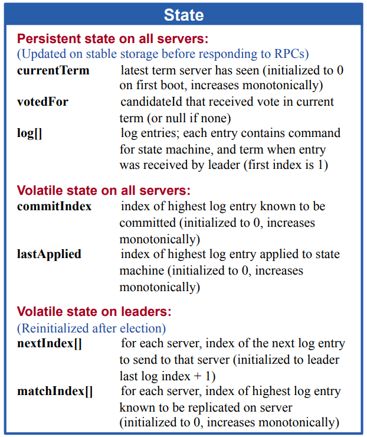

## Introduction

The main task of 2B is to implement log relication and this task is hard. So, hope my experience will help you.

## System Structure

In this task, the command will be deliveried to every node through `Start()` and only the leader will accept this command to process it further. So, we don't need to worry about how the follwer forwards the command to the leader if they receives commands from the client.

As discussed in the [previous article](./2022-12-25-MIT%206.824%20Raft%202A.md). Each server node will run in a loop with a `select` inside to handle different events. For task 2A, the events are starting an election and sending heartbeat. For 2B, we have to add another `case` in `select` to handle the event of replicating log. Hence, I set another timer to triger the log replication event handler. I will discuss more about the timer [here](#log-index). As for the rest, you can just follow the raft paper.

## Debugging

### Log Index

As shown in the definition of the state in the paper, the first index of log entries should start from 1. 

This is extremely important and extremely annoying at the same time. The index of log starting from `1` means that the `commitIndex`,`lastApplied`,`nextIndex[]`,and `matchIndex[]` should all start from `1`. At first, I simply igored this rule and after I did some debuggings, I realized the improtance of it. The `commitIndex` is initialized to `0` and the follower will commit the log entries and update its `commitIndex` only when leader's `commitIndex` is greater than its own. Image this scenario that the system is on a fresh start and the leader commits the first log enty of the entire system. It should update its `commitIndex` to `1`. This way, the followers will receive a correct `leaderCommit` for them to take actions memtioned above. Now, you should be able to see the problem of index starting from `0`. The zero-started index won't be able to have the followers commit the log entries.

However, as programmer, we are definitely more comfortable with index starting from `0`. Dealing with index starting from `1` drives me nuts. So, is there a way to avoid this? The answer is yes. The following ideas are mainly from [Dr. Martin Kleppmann](https://martin.kleppmann.com/). Since every index in raft should start from 1, please remember that in an array `index(starting from 0) + 1 = length`, so, the `index` in raft can actually be replaced with `length`. In this way, we can still treat the log as an array with index starting from `0`. Accordingly, the elements in the `state` should change as follow. 

`commitIndex -> commitLength` 

`nextIndex[] -> sentLength[]` 

`matchIndex[] -> ackedLength[]` (`lastApplied` isn't really necessary).

So, now we can get rid of the annoying index problem. But one last thing to pay attention to is that the test cases still adopt the the rule from the paper. So, when delivering the message to the `apply channel`, remember to plus `1` to the index in the message.

### Log Replication in batch

In some test cases, the length of log entries can be more than 100 or 200. If you replicate the log entries one by one, it will be quite time-comsuming resulting in failing some test cases. One way to optimize this is to replicate the log entries in batch. The timer I mentioned before does this job together with a counter. The counter will count how many new log entries are received but yet to be replicated. Everytime when the timer stops, it will start to replicate the log if the counter is greater than one. I had a different idea at first that to replicate the log everytime the counter hits 5. But this can have some log entris not be replicated for a long time. After all the test, it turns out that the timer works quite well for me.

### Log Replication too Slow

In log replication, there is a process to find the `nextIndex[]/sentLength[]` for each follower in order to replicate the right log entris for each follower. The tradition way to do this is to minus `nextIndex[]/sentLength[]` by `1` everytime the leader receives a reply with `false` from the log request RPC call. This is pretty time-comsuming as well and some test cases will fail because of this. 

In the raft paper, the author mentioned an optimization to this in section 5.3 and the teaching assistant of the course, MIT 6.824, has explained this optimization in more detail. You can see it [here](https://thesquareplanet.com/blog/students-guide-to-raft/#an-aside-on-optimizations).

### Heartbeat and Log Replication

This might be the most valuable thing I learned from this task. I have always consider the heartbeat somehow special and it is different from log replicaton. I have always though that sending a heartbeat is to send a log request with an array of log entries set empty on purpose. However, the truth is that sending heartbeat is no different from sending log replication request and sending heartbeat isn't just to notify the followers that the leader is still alive.

We know that a log entry is first committed by the leader if this log entry is accepted by a quorum of nodes then the follower will commit this log entry when receiving a `leaderCommit` greater than its `commitIndex`. So, for a follower to commit a log entry, it requires at least two log request RPC call, the first is to delivery the log entry to the follower and the second is to delivery the updated `leaderCommit` to tell the follower that you can commit the log entry now. 

But what if the leader only receives one log entry? That means the leader will only send one log replication request to the followers to replicate the log entry. So, this only log entry will never be committed by the followers? No, heartbeat will prevent this from happening. It's true that the leader in this case will only send one log replication request. However, it will keep sending heartbeats. The heartbeat will carry the updated `leaderCommit` so that the followers can commit the log entry. Now, you should be able to understand that sending heartbeat is actually just calling the same function for log replication. You don't have to set the entries empty on purpose for heartbeat. When it is a heartbeat, the entries will be empty atomatically because the non-empty entries will be sent by leader calling log replication request.

### A Possible Problem with PRC Call

When running the test cases of task 2B, I encountered a situation that even though there is no network partition happening, the RPC calls from the leader to the followers keeps failing. I guess this is something to do with the RPC call which is not relevent to this lab. Besides, this doesn't happend that often. So, I just turned a blind eye on this.