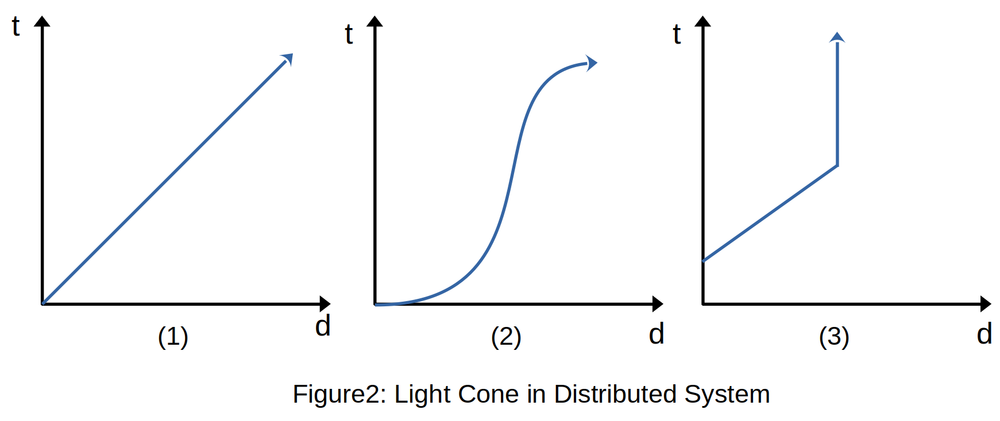

## Introduction
The *Ticktock* in the title means the sound from the swing of a pendulum in a clock. While *TikTok* stands for the vastly distributed computing system in modern IT industry. They two seem to be something irrelevant with each other. However, in this blog, I will try to explain the theorical foundation of distributed system starting from physical time.

## Light Cone
In many articles or slides discussing distributed system, *light cone* is frequently mentioned in order to show that the lack of total order is a fundmental property of the distributed system. However, it is often briefly discussed.

Understanding *light cone* helped me a lot to understand distributed system. So, I would like to start explaining it first to lay down some possible ground.

> In special and general relativity, a light cone (or "null cone") is the path that a flash of light, emanating from a single event (localized to a single point in space and a single moment in time) and traveling in all directions, would take through spacetime.
> 
> -- <cite>[Wikipedia](https://en.wikipedia.org/wiki/Light_cone)</cite>

The definition above is not "human-readable". I will try to explain this with the help of Figure 1.


In this coordinate system, the vertical axis stands for time and the horizontal axis stands for distance. Let's assume an event *e*, happened at the origin and it is spreading at the speed of light (No information can travel faste than light under [special relativity](https://en.wikipedia.org/wiki/Special_relativity)). There is a man standing at *d<sub>1</sub>* at the time *t<sub>0</sub>*. The event *e* has just reached *d<sub>0</sub>* at time *t<sub>0</sub>*, which means the man at *(*t<sub>0</sub>*, d<sub>1</sub>)* doesn't event know the existence of event *e*. If the man just standing still at *d<sub>1</sub>*, at the time *t<sub>1</sub>*, he will know the event *e* happened at the origin some time ago because the information of event has reached the man. At this time the line standing the man has intersected with the line standing the spead of event *e*. From now on, these two lines has an intersection and we call this intersection light cone.

Let's look at a specific example. The average distance between the sun and the earth is 150 million kilometer. If the light travels at the speed of 300 million meter per second, it will take around 8 miniutes for the sun light to reach the earch. That means every beam of the sun light people on earch see was generated 8 miniutes ago. If now, all of a sudden, the sun explodes, people on earch will know this tragedy 8 miniutes later. During these 8 minutes, people on earch would still consider everything to be fine.

 Besides that, light can travel [at different speeds or even stops  travling](https://plato.stanford.edu/entries/spacetime-singularities/lightcone.html#:~:text=We%20have%20a%20black%20hole,without%20traveling%20faster%20than%20light.) in the universe. That means there are something you might never to be able to know.

> Fate lies within the light cone.
> -- <cite>Liu Cixin</cite>

If you look at the light cone in a higher view, you will probably be able to understand this famous remark from the book, *the three-body prblem*, by Liu Cixin. There are a lot of things, good or bad, happening in the whole universe at the same time. It's just that you don't know it yet or you don't know it forever. It might take miniutes, days, or even years for the information to reach you. At the time you know them, you can't do anything to change them but accept them. This is called fate.

The above explaination of light cone is for sure not totally scientifically correct. But I think it is enough for the following content.

## Ordering Events in Light Cone
Recall the case described in Figure 1. When the information reaches the man, the man at the time *t<sub>1</sub>* knows for sure this event *e* happened at some time before now. But what if the information of more than one events arrive at the same time, how can they be ordered? The timestamp. If every event comes with a timestamp to indicate when it actually happened, they can be easily be ordered. In the real world, the timestamp is the physical time.

Now events that are known can be ordered with help of timestamp. But how should the events that are still unknown be dealt with? At a point of time, you can give a "correct" order of all known events. However, maybe some time later, information of other events happened in the past has arrived and the order of all known events at this moment is definitely different from the one before.

So, one can never say for sure at a point of time that there is a correct order.

## Light Cone in Distributed System
The idea of light cone can actually be applied to explain the difficulty of ordering event in distributed system as well.

From the previous section, we know that in order to form a correct order of all events we need two prerequisites.
> - Timestamp
> - Knowing all events

They happened to be the two pain spots of distributed system.
> - There is no global clock in distributed system
> - There is no reliable communication in distributed system

### Global Clock
Time is a man-made concept. The temporal interval between the happenings of two events is called time. In order to make this concept universal, in [history of timekeeping devices](https://en.wikipedia.org/wiki/History_of_timekeeping_devices), there are many tools being utilized, e.g. Stonehenge, obelisk, water clock, incense clock, and sandglass. The idea behind these tools is to use something that happens temporally regularly to represent an time interval. Nowsdays, the idea of time is still the same but the tools has changed dramatically ([atomic clock](https://en.wikipedia.org/wiki/Atomic_clock), [satellites](https://www.gps.gov/applications/timing/)) to provide more precise measurements of time.

Unfortunately, even with these highly precise and synchronized time measurements, [it is still unreliable to use physical time directly in distributed system](http://infolab.stanford.edu/~burback/dadl/node91.html#:~:text=In%20a%20distributed%20system%20there,clock%20has%20the%20exact%20time.).

### Communication
In real world, there are many medium to carry information, sound, smell, and light. But in distributed system, the only mediunm is the network. Machines exchange information through network.

But network is unstable. It might slow down, occasionally disconnect ([shark bite](https://www.forbes.com/sites/amitchowdhry/2014/08/15/how-google-stops-sharks-from-eating-undersea-cables/)), or even permently disconnect (manually unpluged). If we apply light cone to the network in distributed system, we might see something like Figure 2. The first one means that the information is being spreaded steadily through the network. The second means that there are some network turbulentce making the speading sometimes faster and sometimer slower. As for the last one, I call it *network black hole*. You can see the information has stopped spreading sometimes like the light can't escape from blackhole.




### Summary
Now we are clear of what difficulties are there when implementating a distributed system. We will discuss how to address these problems in the following content.


## Distributed System
### Logical Clock
The solution to the lack of global clock in distributed system is logical clock. There are two kinds of logic clock, [lamport clock](https://lamport.azurewebsites.net/pubs/time-clocks.pdf) and [vector clock](https://en.wikipedia.org/wiki/Vector_clock). With logic clock, events in distributed system can be arranged in partial order or total order. For more detail, please refer to [this slide](http://www.cs.cmu.edu/afs/cs/academic/class/15712-f15/www/lectures/05-ordering.pdf).

### Broadcast Algorithm
#### Network Behaviour
Nework behaviour describes what might happen between **point-to-point** communication between two nodes. The network behaviour in distributed system can be classified into three.
> - **Reliable** links: A message is received if and only if it is sent. Message may be reordered
> - **Fair-loss** links: Messages may be lost, duplicated, or reordered. If you keep retrying, a message eventually gets through
> - **Arbitrary** links: A malicious adversary may interfere with messages (eavesdrop, modify, drop, spoof, replay)

#### Broadcast
One node sends a message and all nodes in the group deliver it. Broadcast in distributed system is built upon point-to-point communication. Hence, broadcast may drop messages or try to retransmit dropped messages to provide **reliable** broadcast. 

The broadcast algorithm acts as a middleware between message sender/receiver and the network. It can be broken down into two layers:
> 1. Make best-effort broadcast **reliable** by retransmitting dropped messages
> 2. Enforce delivery order on top of **reliable broadcast**

#### Summary
Till now, the problems seem to be solved. Logical clock can act as a global clock in distributed system and broadcast algorithm can **reliably** broadcast all messages and get them ordered.

However, the word `reliable` is constantly mentioned above. Broadcast algorithm works on the condition that the underlying network can provide the ground for reliable communication. But what if in a distributed system, some nodes in it are temporarily or permently disconnected from the rest, which means any communication between can be delayed for some amount of time or forever. How should distributed system behave under this situation?

## CAP Theorem
CAP theorem states that when there is a **network partition** in distributed system, the system chooses either **consistency** (every read receives the most recent write or an error) or **availability** (every request receives a response, without the guarantee that it is the most recent write).

CAP theorem indicates the tradeoff for a distributed system when facing network partition.

### Variant of CAP Theorem
In the actual implementation of a distributed system, how is a network partition detected? How does the system distinguish between messages arriving slowly and messages never arriving?

The answer is **latency**. When the communication between nodes in distributed system has delayed for some certain time, it is considered a network partition. In this case, CAP theorem can be interpreted in another way called **PACELC theorem**.

```
PACELC:
if there is a network Partition:
    choose between Availability and Consistency
else
    choose between Latency and Consistency
```
### Timing Assumptions
Based on latency, we can introduce timing assumptions for distributed system.
- **Synchronous**: Message latency no greater than a know upper bound. Nodes execute algorith at a know speed.
- **Paritally synchronous**: The system is asynchronous for some finite (but unknown) periods of time, synchronous otherwise
- **Asynchronous**: Messages can be delayed arbitrarily. Nodes can pause execution arbitrarily. No timing guarantees at all.

### Analysis on Raft
Let's try to analyse raft to understand the whole thing above better.

Raft chooses *A* over *C* when *P* and *L* over *C* when *no P*. 

When there is a network partition, as long as there are still a quorum of nodes available, raft can still provide service. Data consistency will be guaranteed when the disconnected nodes join back. 

When there is no network partition, as long as the data are written by a quorum of nodes, the system continues without blocking. The nodes will be inconsistent for some finite periods of time, but eventually they will be consistent.