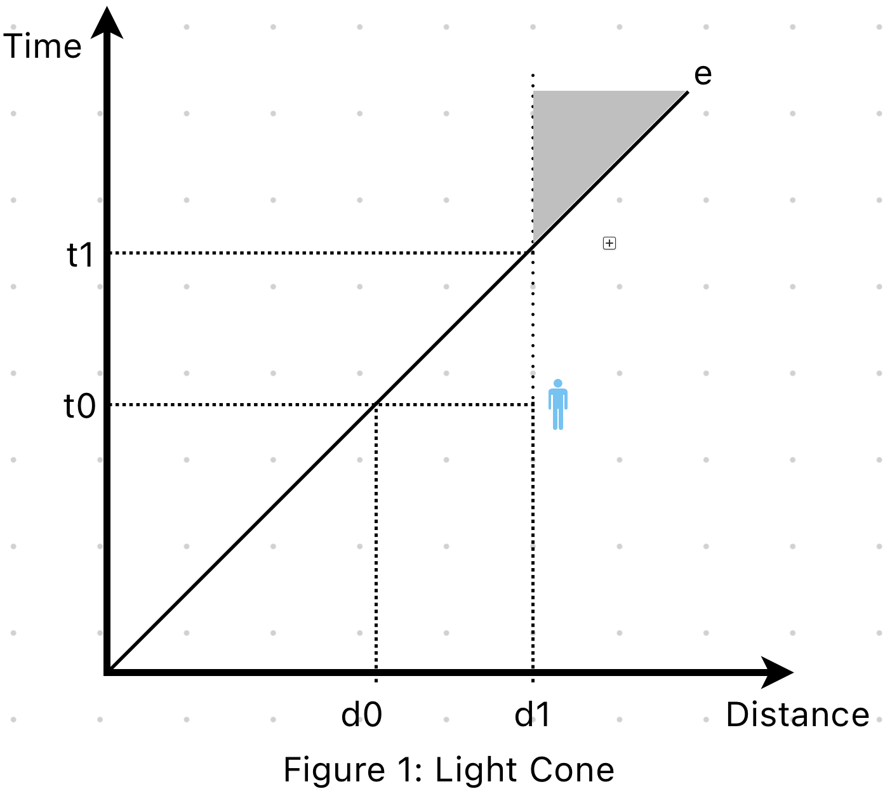

## Introduction
The *Ticktock* in the title means the sound from the swing of a pendulum in a clock. While *TikTok* stands for the vastly distributed computing system in modern IT industry. In this article, I will try to explain the theorical foundation of distributed system starting from physical time.

## Light Cone
In many articles or slides discussing distributed system, *light cone* is frequently mentioned in order to show that the lack of total order is a fundmental property of the distributed system. However, it is often briefly discussed.

Understanding *light cone* helped me a lot to understand distributed system. So, I would like to start explaining it first to lay down some possible ground.

> In special and general relativity, a light cone (or "null cone") is the path that a flash of light, emanating from a single event (localized to a single point in space and a single moment in time) and traveling in all directions, would take through spacetime.
> 
> -- <cite>[Wikipedia](https://en.wikipedia.org/wiki/Light_cone)</cite>

The definition above is not "human-readable". I will try to explain this with the help of Figure 1.

In this coordinate system, the vertical axis stands for time and the horizontal axis stands for distance. Let's assume an event *e*, happened at the origin and it is spreading at the speed of light (No information can travel faste than light under [special relativity](https://en.wikipedia.org/wiki/Special_relativity)). There is a man standing at *d1* at the time *t0*. The event *e* has just reached *d0* at time *t0*, which means the man at *(*t0*, d1)* doesn't event know the existence of event *e*. If the man just standing still at *d1*, at the time *t1*, he will know the event *e* happened at the origin some time ago because the information of event has reached the man. At this time the line standing the man has intersected with the line standing the spead of event *e*. From now on, these two lines has an intersection and we call this intersection light cone.

Let's look at a specific example. The average distance between the sun and the earth is 150 million kilometer. If the light travels at the speed of 300 million meter per second, it will take around 8 miniutes for the sun light to reach the earch. That means every beam of the sun light people on earch see was generated 8 miniutes ago. If now, all of a sudden, the sun explodes, people on earch will know this tragedy 8 miniutes later. During these 8 minutes, people on earch would still consider everything to be fine.

 Besides that, light can travel [at different speeds or even stops  travling](https://plato.stanford.edu/entries/spacetime-singularities/lightcone.html#:~:text=We%20have%20a%20black%20hole,without%20traveling%20faster%20than%20light.) in the universe (May not be scientifically correct). That means there are something you might never to be able to know.

> Fate lies within the light cone.
> -- <cite>Liu Cixin</cite>

If you look at the light cone in a higher view, you will probably be able to understand this famous remark from the book, *the three-body prblem*, by Liu Cixin. There are a lot of things, good or bad, happening in the whole universe at the same time. It's just that you don't know it yet or you don't know it forever. It might take miniutes, days, or even years for the information to reach you. At the time you know them, you can't do anything to change them but accept them. This is called fate.

## Light Cone in Distributed System