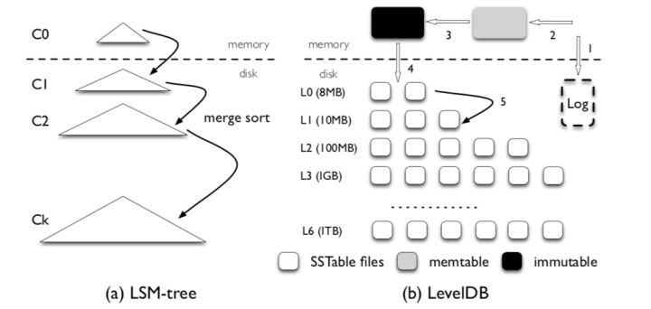
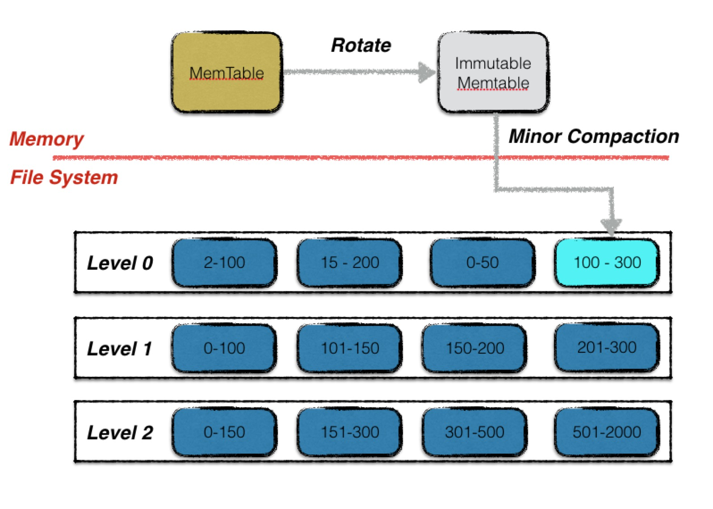
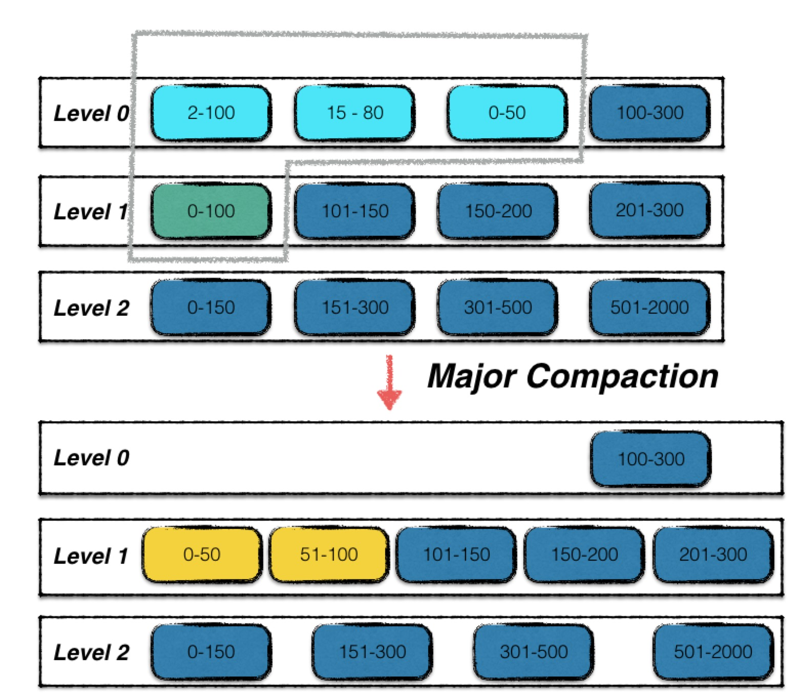
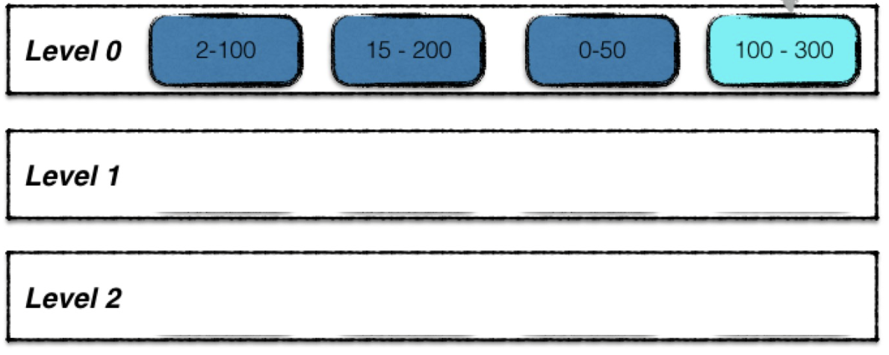

### MemTable and Immutable MemTable
MemTable is a in-memory skip list. When a MemTable is full, it will become immutable and wait to be flushed to disk. 

### SSTable
SSTable are stored on disk and they are ordered so to be able to offer a quick binary search.

### Flush and Compaction
#### Flush / Minor Compaction
<figure>
  
  <figcaption>Figure 1: LevelDB Minor Compaction</figcaption>
</figure>

Flush in levelDB is called Minor Compaction. Figure 1 is from [leveldb handbook](https://leveldb-handbook.readthedocs.io/zh/latest/) (Non-official document and only available in Chinese). The figure shows that when immutable MemTable is flushed into Level 0 on disk, the SSTable files in level 0 are only **locally ordered**, not globally ordered. However, the files in other levels are both **locally and globally** ordered.

#### Compaction / Major Compaction
<figure>
  
  <figcaption>Figure 2: LevelDB Major Compaction</figcaption>
</figure>
Compaction in levelDB is called Major Compaction. In levelDB, when the number of SSTable files reaches `4`, major compaction will be carried out. In figure 2, the first 3 SSTable files (colored in light blue) in level 0 are compacted with the first SSTable file (colored in green) in level 1 since they share the same key range. And then they are split into two SSTable files (colored in yellow).

### Questions

#### How are the files to be compacted decided?
 <figure>
  
  <figcaption>Figure 3: Major Compaction with empty levels</figcaption>
</figure>

In the case in figure 3, maybe it is a fresh start of the sytem, which files in level 0 should be compacted into the empty level 1? Files are chose based on what?

The size of SSTable file in different levels are different. For example, the size in level 1 is usually 10 times larger than the size in level 0. So, the SSTable files from the level will chose so that they fit the size of the SSTable in next level as much as possible.

#### How to understand SSTable is immutable
In figure 2, files from two levels are merged and then split in order to be globally ordered. In this process, isn't the SSTable file **mutated**?

The SSTable is **immutable**. When files from different level are merged, the operation is actually not on the files directly. It first read the data in all files, order the data and then write them into **new files**. The old files will be garbage collected.

#### Not Globally ordered at level 0
Level 0 is some kind of special case. It receives the flushed file directly from memory.