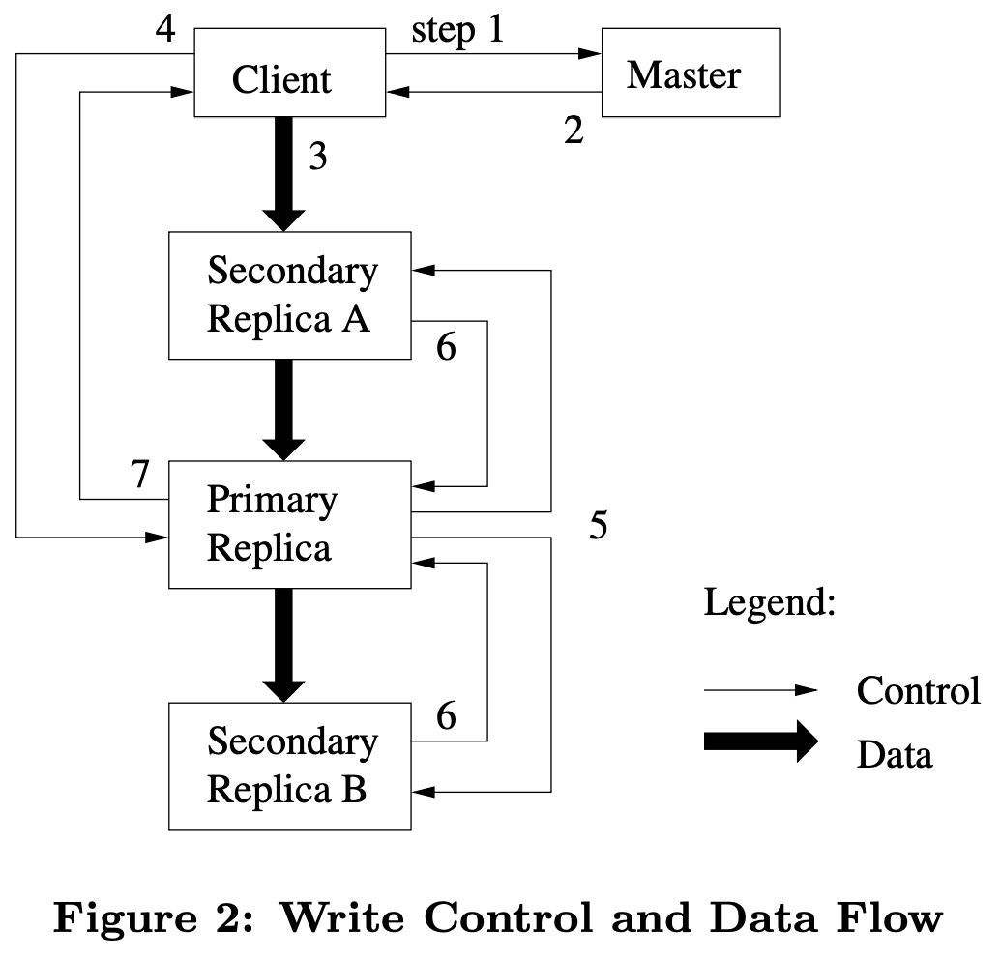

## GFS Architecture Overview

## Master
### Metadata in Master
#### Metadata 
1. `namespace` and `file names`: [Prefix compression](https://dzone.com/articles/algorithm-week) is used to store namespace efficiently
2. `file name` -> `array of chunk handles`
3. `chunk handles` -> `(version, list of chunkservers, primary, lease)`

##### Chunk Locations (List of chunkservers)
The master polls chunkservers for the record of which chunkservers have a replica of a given chunk at **startup** and **then** the master can keep itself up-to-date because it control all chunk placement and monitors chunkserver status with regular *HeartBeat* messages (master $\rArr$ chunkservers). 

This **eleminated** the problem of keeping the master and chunkservers in sync as chunkservers join and leave the cluster, change names, fail, restart, and so on.

##### Metadata Storage
1. Metadata is stored in memory so that master operations are **fast**. 

However, the **first two are also kept persistent** by logging mutations to an *[operation log](#operation-log)* stored on the master's **local disk** and replicated on remote machines.

###### Operation Log
The operation log contains a historical record of **critical** metadata changes
- It is the only persistent record of metadata
- It serves as a logical time line that defines the order of [concurrent operations](#guarantees-by-gfs)

Files and chunks, as well as their versions, are all uniquely and eternally identified by the logical times at which they were created.

`Master recovers its file system state by replaying the operation log` 
$\rArr$ `To minimize startup time, log should be small` 
$\rArr$ `Master creates checkpoint whenever the log grows beyond a certain size`.

###### Checkpoint
Checkpoint is in a **compact B-tree** (Prefix compression) like form that can be directly mapped into memory and used for namespace loopup without extra parsing.

When creating checkpoint, the master switches to **a new log file** and creates the new checkpoint in a separate thread. This way the incoming mutations won't be delayed. The new checkpoint includes all mutations before the switch. See example [here](#namespace-management-and-locking).

2. Furthermore, it is easy and efficient for the master to **periodically scan** through its entire state in the background with metadata storaged in memory. 

This **periodic scanning** is used to implement [chunk garbage collection](#garbage-collection), [re-replication](#re-replication) in the presence of chunkserver failures, and [chunk migration](#rebalancing) to balance load and disk space usage across chunkservers.

### Master Operations
#### Namespace Management and Locking
- GFS allow mulitple operations to be active and use locks over regions of the namespace to ensure proper serialization.

- GFS logically represents its namespace as a lookup table mapping full pathnames to metadata. With prefix compression, this table can be efficiently represented in memory.

- Each node in the namespace tree (either an absolute file name or an absolute directory name) has an associated **read-write lock**.

##### Example
Cocurrent snapshot and file creation.
 - Snapshot `/home/user` $\rArr$ `/save/user`
   - read lock $\rArr$ `/home` and `/save`; 
   - write lock $\rArr$ `/home/user` and `/save/user`
  ###### why does write lock for `/home/user` is needed for snapshot?
   See [here](#the-paper-mentions-reference-counts----what-are-they)
   
 - File creation `/home/user` $\rArr$ `/home/user/foo`
   - read lock $\rArr$ `/home` and `/home/user`
   - write lock $\rArr$ `/home/user/foo`

Conflicting locks on `/home/user` and hence file creation will fail (write lock has higher priority?).

**File creation does not require a write lock on the parent directory** because there is no "directory", or *inode*-like, data structure to be protected from modification.

*Read lock* on the directory name suffices to prevent the directory from being deleted, renamed, or snapshotted. In this case, concurrent mutations in the same directory is possible. For example, concurrent file creations in the same directory: each acquires a read lock on the directory name and a write lock on the file name.

#### Replica Placement
Chunk replica placement policy:
- maximize data reliability and availablity
- maximize network bandwidth utilization

#### Creation, Re-replication, Rebalancing
Chunk replicas are created for **three reasons**: `chunk creation`, `re-replication`, and `rebalancing`

#### Creation
When the master *creates* a chunk, it chooses where to place the initially empty replicas:
- We want to place new replicas on chunkservers with below-average disk space utilization
- We want to limit the number of "recent" creations on each chunkserver
- We want to spread replicas of a chunk across racks

#### Re-replication
The master *re-replicates* a chunk as soon as the number of available replicas falls below a user-specified goal for the following possible reasons:
- A chunkserver becomes unavailable
- A chunkserver's replica may be corrupted
- A chunkserver's disks is disable
- The replication goal is increased

The chunk re-replication has priority and the new replica is placed with goals similar to those for creation.

#### Rebalancing
The master examines the current replica distribution and moves replicas for better disk space and load balancing.

#### Garbage Collection
GFS does lazy garbage collection at both the file and chunk levels.

##### Mechanism
###### File delection:
1. The file is renamed to a hidden name including the deletion timestamp.
2. During the master's regular scan of namespace, it removes any such hidden files existing for more than three days (interval configurable).
3. When the hidden file is removed from the namespace, its in-memory metadata is erased.

###### Chunk delection:
1. The master identifies orphaned chunks (i.e., those not reachable from any file) during the regular scan of the chunk namespace and erases the metadata for those chunks.
2. In a *HeartBeat* message, each chunkserver reports a subset of the chunks it has.
3. The master replies with the identity of all chunks that are no longer present in the master's metadata.
4. The chunkserver is free to delete its replicas of such chunks.

#### Stale Replication Detection
- The master maintains a *chunk version number* to distinguish between up-to-date and stale replicas.
- Whenever the master grants a new lease on a chunk, it increases the chunk version number and informs the up-to-date replicas.
- The master removes stale replicas (metadata) in its regular garbage collection
- The master will notify the client with version number and the version number will be verified by the client or the chunkserver

## System Interactions
### Read Operation
#### Workflow
1. Client maps `Filename + Offset` to `Filename + Chunk Index` and send request to master node.
   ##### Questions
      - Each file is stored sequentially? `Offset / Chunk Size == Chunk Index`?
         Write-append only.
      - Read request across multiple chunks.
         GFS library will notice this and seperate the request into two. Client reads data from two data nodes.
      - Each file begins with a new chunk? A chunk won't be shared with others?
         A chunk won't be shared by multiple files, which will bring the internal fragmentation problem. GFS adopts [lazy space allocation](#what-is-internal-fragmentation-why-does-lazy-allocation-help) to reduce this problem.
2. Master looks for `chunk handle + chunk locations` in metadata based on the `chunk index` and return them to client
   `Master holds the mapping of file name to array of chunk handles`
3. Clients caches the returned data, using `file name + chunk index` as key
4. Clients chooses the closest data node and get data with `chunk handle + chunk locations`

### Update Operations
#### Write Operation

1. Client ask master which chunkserver is `Primary` and which chunkservers are `Secondary`. Master grants a lease to some chunkserver when there is no `Primary`
2. Client caches the information from master and only contacts master further when `Primary` is unreachable or lease expires (lease information is in metadata)
3. Clients sends append log (data) to every chunkserver. Chunkservers write the request to LRU **caches** (not on disk) first.
4. On receiving acknowledge from all chunkservers, client sends append request (operation) to `Primary`. `Primary` serializes requests (when mulitple request exist) and write them locally first.
5. `Primary` sends requests and the order of requests to all `Secondary`.
6. `Secondary` responds to `Primary` after finishing handling the requests.
7. Start over `step 3-7` on any failure from `Secondary`.

##### Lease
To avoid that the master becomes the performance bottleneck. Distributed write requests to `Primary` Node.
Leader apporach to have total order.

###### No Read Lease in GFS?
Concurrent reads will never be a problem. The possible problem is that there is writing and reading at the same time. ~~But remember that GFS is `record-append only`. There is no modification on the old data. New data can only be appended at the end of files, whichi means there is will never be the case that a read and a write being applied on the same data.~~

> We support the usual operations to *create*, *delete*, *open*, *close*, *read*, and *write* files.
> Moreover, GFS has *snapshot* and *record append* operations. [...] Record append allows multiple clients to append data to the same file concurrently while guaranteeing the atomicity of each individual client's append.

#### Atomic Record Appends
The system interactions for record appends are largely the same as discussed for writes, with the following exceptions:

- In step 4, the primary first checks to see if appending the record to the current chunk would exceed the maximum size of 64MB. If so, the primary pads the chunk, notifies the secondaries to the same, and then tells the client to retry the request on the next chunk.
- If the record append fails on any of the replicas, the client must retry the operation. As discussed in the [consistency section](#consistency-model), this means that replicas of the same chunk may contain duplicates.
- A record append is successful only when the data has been written at the same offset on all the replicas of a chunk.

### Snapshot
The snapshot operation makes a copy of a file or a directory tree almost instantaneously, while minimizing any interruptions of ongoing mutations.

#### Workflow
`Master receives snapshot request` 
$\rArr$ `Master revokes any outstanding leases on the according chunks` 
$\rArr$ `Any sybsequent writes to these chunks ask master for lease holder frist` 
$\rArr$ `Master has the opportunity to create a new copy of the chunk first` 
$\rArr$ `Master asks each chunkserver to create a new chunk`

After all leases are revoked or expired.
`Master logs the operation to disk` 
$\rArr$ `Master applies this log record to its in-memory state by duplicating the metadata for the source file or directory tree`

The newly created snapshot files point to the same chunks as the source files.

## GFS
### Consistency Model
GFS is a weak consistency model. Not every copy of data are identical.

`defined`: After a file data mutation, a file region is consistent and clients will see what the mutation writes in its entirety.
`consistent`: All clients will always see the same data, regardless of which replicas they read from.

For `write`: write might succeed on some replicas and might fail on some replicas, which results in data inconsistency between replicas.

For `record append`: retry on failure. But the retry will not be carried out at the previous offset but the previous offset plus failed part. This will cause permanent inconsistency and duplicate data.

- serial success write: defined
- concurrent write: consistent but undefined. 
  >If a write by the application is large or straddles a chunk boundary, GFS client code breaks it down into multiple write operations. They [...] may be interleaved with and overwritten by concurrent operations from other clients. Therefore, the shared file region may end up containing fragments from different clients, although the replicas will be identical because the individual operations are completed successfully in the same order on all replicas. This leaves the file region in consistent but undefined state [...].
- serial and concurrent success record append: defined with inconsistent data region

### Guarantees by GFS
1. **File namespace mutations (e.g., file creation) are atomic**. They are handled exclusively by the master: **namespace locking** gurarantees atomicity and correctness; the master's operation log defines a global **total order** of these operations (namesapce mutations).
2. The mutated file region is guaranteed to be **defined** and contains the data written by the last mutation.
   - Applying mutations to a chunk in the same order on all its replicas
   - Using chunk version numbers to detect any replica that has become stale because it has missed mutations while its chunkserver was down.

Stale replicas will never be involved in a mutation or given to clients asking the master for chunk locations. They are garbage collected at the earliest opportunity.

Clients with cached chunk locations might still read from a stale replication before the chunk locations information is refreshed. However, most of the files are append-only, a stale replica usually returns a **premature end** of chunk rather than outdated data.

##### Will all replicas become stale?
No. See [here](#re-replication)

### Fault Tolerance
Fault Tolerance is achieved in GFS by implementing:

- **Fast Recovery** - The master and the chunkservers are designed to restore their state and start in a matter of seconds.

- **Chunk Replication**: Each chunk is replicated on multiple chunkservers on different racks. This ensures that some replicas are still available even if a rack is destroyed. The master is able to clone existing replicas as needed when chunkservers go offline or a replica is detected as stale or corrupted.

- **Master Replication**: The master is also replicated for reliability. A state mutation is considered committed only when the operation log has been flushed to disk on all master replicas. When the master fails, it can restart almost immediately.
  
In addition, there are shadow masters which provide read-only access to the filesystem when the file is down. There may be a lag in replicating data from the primary master to its shadows, but these shadow masters help to improve availability.

### Data integrity
Checksumming is used by each chunkserver to detect the corruption of stored data.

> A checksum algorithm takes a block of bytes as input and returns a single number that's a function of all the input bytes. For example, a simple checksum might be the sum of all the bytes in the input (mod some big number). GFS stores the checksum of each chunk as well as the chunk.
> 
> When a chunkserver writes a chunk on its disk, it first computes the checksum of the new chunk, and saves the checksum on disk as well as the chunk. When a chunkserver reads a chunk from disk, it also reads the previously-saved checksum, re-computes a checksum from the chunk read from disk, and checks that the two checksums match.
> 
> If the data was corrupted by the disk, the checksums won't match, and the chunkserver will know to return an error. Separately, some GFS applications stored their own checksums, over application-defined records, inside GFS files, to distinguish between correct records and padding. CRC32 is an example of a checksum algorithm.
> 
> -- <cite>[MIT 6.824 Q&A](#some-questions-from-mit-6824)</cite>

## Some Questions from MIT 6.824
Refering from [MIT 6.824 Q&A](http://nil.csail.mit.edu/6.824/2021/papers/gfs-faq.txt).
#### How does an application know what sections of a chunk consist of padding and duplicate records?
To detect padding, applications can put a **predictable magic number** at the **start of a valid record**, or include a **checksum** that will likely only be valid if the record is valid. The application can detect duplicates by including unique IDs in records. Then, if it reads a record that has the same ID as an earlier record, it knows that they are duplicates of each other. GFS provides a library for applications that handles these cases.

#### How can clients find their data given that atomic record append writes it at an unpredictable offset in the file?
Append (and GFS in general) is mostly intended for applications that sequentially read entire files. Such applications will scan the file looking for valid records (see the previous question), so they don't need to know the record locations in advance. For example, the file might contain the set of link URLs encountered by a set of concurrent web crawlers. The file offset of any given URL doesn't matter much; readers just want to be able to read the entire set of URLs.

#### 64 megabytes sounds awkwardly large for the chunk size!
The 64 MB chunk size is the unit of book-keeping in the master, and the granularity at which files are sharded over chunkservers. Clients could issue smaller reads and writes -- they were not forced to deal in whole 64 MB chunks. The point of using such a big chunk size is to reduce the size of the meta-data tables in the master, and to avoid limiting clients that want to do huge transfers to reduce overhead. On the other hand, files less than 64 MB in size do not get much parallelism.

#### What if the master fails?
There are replica masters with a full copy of the master state; the paper's design requires human intervention to switch to one of the replicas after a master failure (Section 5.1.3). We will see later how to build replicated services with automatic cut-over to a backup, using Raft.

#### What is internal fragmentation? Why does lazy allocation help?
Internal fragmentation is the space wasted when a system uses an allocation unit larger than needed for the requested allocation. For example, in GFS the risk is an application creates a 1-byte file and 64M-1byte is wasted, because the allocation size is 64MB (a chunk). GFS avoids this potential problem, because the 64MB is lazy allocated. Every chunk is a Linux file, and so when an application creates 1-byte file, the on-disk representation of the chunk is 1-byte Linux file.

#### The paper mentions reference counts -- what are they?
They are part of the implementation of copy-on-write for snapshots. When GFS creates a snapshot, it doesn't copy the chunks, but instead increases the reference counter of each chunk. This makes creating a snapshot inexpensive. If a client writes a chunk and the master notices the reference count is greater than one, the master first makes a copy so that the client can update the copy (instead of the chunk that is part of the snapshot). You can view this as delaying the copy until it is absolutely necessary. The hope is that not all chunks will be modified and one can avoid making some copies.

## Reference
1. [GFS Paper](https://static.googleusercontent.com/media/research.google.com/en//archive/gfs-sosp2003.pdf)
2. [MIT 6.824 study notes](https://timilearning.com/posts/mit-6.824/lecture-3-gfs/)
3. [MIT 6.824 Q&A](http://nil.csail.mit.edu/6.824/2021/papers/gfs-faq.txt)