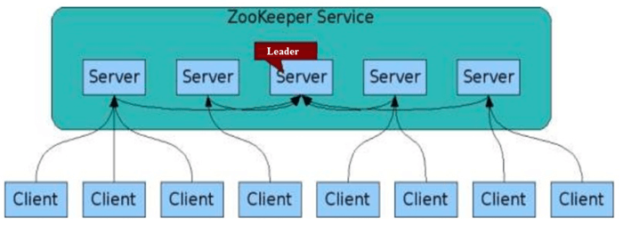
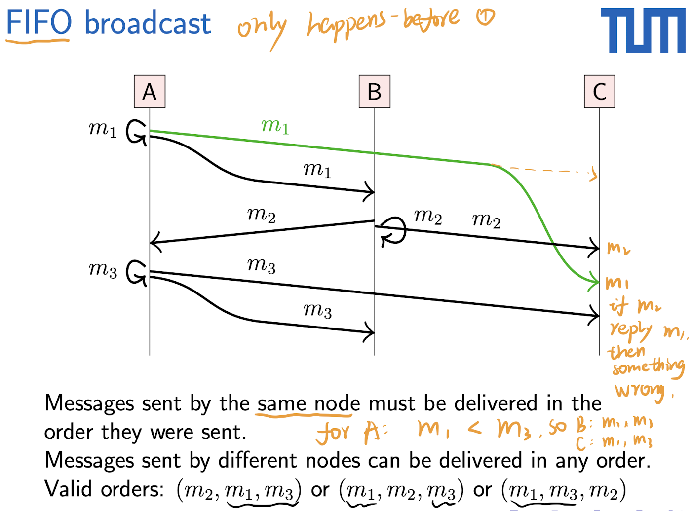
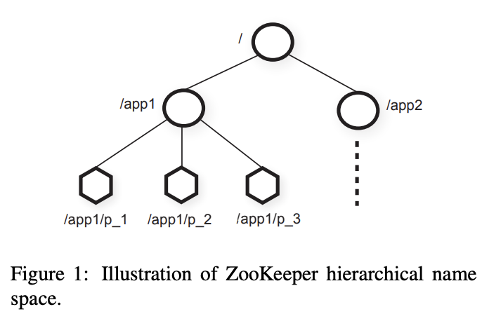
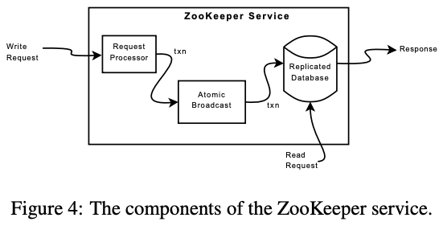
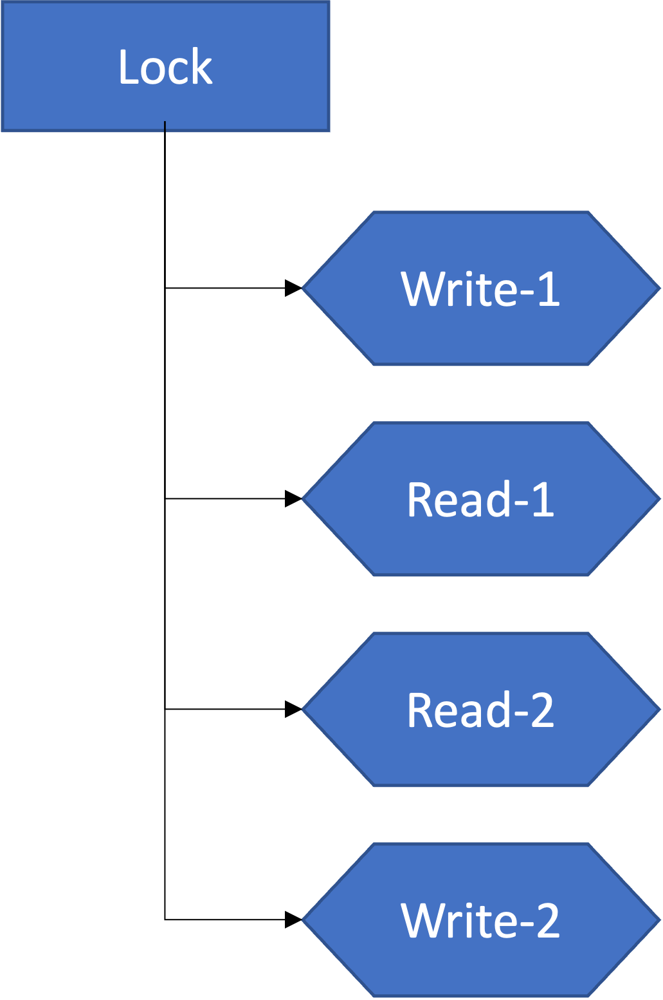

## Introduction
ZooKeeper is not designed for general data storage. Instead, znodes map to abstractions of the client application, typically correspnding to meta-data used for coordination purposes.

Implementing `wait-free` data objects differentiates ZooKeeper significantly from systems based on blocking primitives such as locks.

## ZooKeeper Architecture


Severs are classified into **leader** and **follower**. This is pretty much the same as Raft. However, unlike Raft, all nodes in ZooKeeper can handle **read** requests while **write** requests still go to leader.

So, we can say that **ZooKeeper is designed for distributed system with read-dominant workloads**.

But the read request can get outdated information. Hence, there is no linearzability in ZooKeeper. In order to address this problem, **linearzible writes** and **FIFO-ordering for clients** are introduced.

### Linearzible Writes
> All request that update the state of ZooKeeper are **serializable** and respect precedence (Updates are linearizable).

To guarantee that update operations satisfy linearizability, ZooKeeper implements a leader-based atomic broadcast protocol, called Zab. However, ZooKeeper can only guarantee all write requests are ordered by the leader and the order will be applied to every node in ZooKeeper. Read requests are not guaranteed to get the lastest data when there are requests from multiple clients (it is different when there is only one client, see next section).

### FIFO-ordering for Clients
> All **requests** (not just write requests) from a given client are executed in the order that they were sent by the client.



For write requests, all writes requests from a single client will be sent to the leader, get ordered by the leader, and be carried in the order they were sent. For example, in the above figure, client A sends *m<sub>1</sub>* first then *m<sub>3</sub>*. Client B sends *m<sub>2</sub>*. So the vaild orders of all events can be *(m<sub>2</sub>, m<sub>1</sub>, m<sub>3</sub>)*, *(m<sub>1</sub>, m<sub>2</sub>, m<sub>3</sub>)* or *(m<sub>1</sub>, m<sub>3</sub>, m<sub>2</sub>)*.

For read requests, a read request can be carried on multiple server in the case that a server crashes when answering to the read request. So, the read request has be to redirected to other server.

Let's say there is **only one client** in the system and the client issued a sequence of requests as following, `write(A=10), write(B=8), read(B), read(A)`. These requests must be carried in this order, which means `read(B)` returns `8`. 

There is a **mechanism**, zxid, in ZooKeeper to make sure that **no matter the read request goes to which server**, it will get the lastest result. The read request will also carry a *zxid* of the latest preceding operations that the client submitted. **The server will ensure its state is at least as up to date as the client's zxid before responding**.

However, this is not guaranteed if there are multiple clients. Other clients might write B as well and the requests might be arranged between `write(B=8)` and `read(B)`.

So, is ZooKeeper linearizable or not?
**ZooKeeper is neither totaly linearizable or totaly non-linearizable.** It provides linearizability only when there is one client.

### sync
`sync` method is an operation to make sure the read request can get the lastest data.

Consider the scenario of two clients, A and B. If client A sets the value of a znode `a` from 0 to 1, then tells client B to read `a`, client B may read the old value of 0, depending on which server it is connected to. If it is important that Client A and Client B read the same value, Client B should should call the **sync()** method from the ZooKeeper API method before it performs its read.

## Data Model

Two kinds of znode:
   - **Regular**: Clients manipulate regular znodes by creating and deleting them explicitly
   - **Ephmeral**: Clients create such znodes, and they either delete them explicitly, or let the system remove them automatically when the session that creates them terminates (deliberately or due to a failure)

Both znodes can store data. However, **ephmeral znode cannot have any child znodes**.

When creating new znodes, `sequential` flag can be added so that the value of a monotonically increasing counter will be appended at the end of the name of newly created znodes, `name+seq_No.`. The counter is maintained by the father node.

So, there are actually in total 4 types of znode:
- `PERSISTENT`
- `EPHEMERAL`
- `PERSISTENT_SEQUENTIAL`
- `EPHEMERAL_SEQUENTIAL`

## ZooKeeper Implementation


- **Request Processor**: Turn the received requests into *idempotent* transations
- **Atomic Broadcast**: Based on *zab* to reach consensus
- **Replicated Database**: Each replica has a copy in memory of the ZooKeeper state. ZooKeeper takes snapshots periodically and they are *fuzzy snapshots* since the state will not be locked to take snapshot. Instead, reading the state atomically and write them to disk.
  
#### Are zookeeper's API functions idempotent?

Definitely not.  E.g., sequential znode create bumps counter
#### Why does section 4.1 say "transactions are idempotent"?

API calls get translated into idempotent server-side transactions `<transactionType, path, value, new-version>`.
Transactions sent through atomic broadcast, replicated on all servers

#### What's the issue with calculating "future state"?

Zookeeper pipelines operations. 

So there may be multiple transactions where atomic broadcast not complete. Can't apply state if transactions not committed. 

But to make it idempotent, need to know the result (e.g., new counter value). So calculate state based on previous pending transactions, too.

#### Why not just apply transactions to in-memory state before atomic broadcast? 
What if there's a network partition, new primary elected w/o applying Would need to reconstruct memory state, and transactions not reversible 

#### What is the advantage of idempotent transactions? 
- Allows write-ahead logging 
- Also, makes fuzzy snapshot mechanism work.

## APIs
> **create(path, data, flags)**: Create a new *znode* at *path* storing *data* and return the name of the new znode. A znode can only be created if it does not already exists. *flags* are used to indicate whether it is a regular or ephemeral and sequential or not.
> 
> **delete(path, version)**: If the version of *znode* at the *path* equals *version*, then delete the znode
> 
> **exists(path, watch)**: Return true if there is a *znode* at *path*, return false else.
> 
> **getData(path, watch)**: return data and metadata (e.g. version).
> 
> **setData(path, data, version)**: If *znode.version* == *version*, then update the *data*.
> 
> **getChildren(path, watch)**: Return all names of child znodes
> 
> **sync(path)**：Wait until all operations that updates the data arrive. `Sync` causes a server to apply all peding write requests before processing the read without the overhead of a full write. This primitive is similar in idea to the `flush` primitive of ISIS.

There are *synchronous* and *asynchronous* versions of the API calls above. 

An application calls the synchronous API when it needs to execute a single ZooKeeper operation and it has no concurrent tasks to execute.

An application calls the asynchronous API when it has multiple outstanding ZooKeeper operations and other tasks to be executed in parallel.

#### No open() or close()
There are no handles to access *znodes*. Each request has to include the full path of the *znode* being operated on.

### Watch
*Watch* is to monitor this znode. *Watch* is to allow clients to receive timely notifications of changes without requiring polling. When a client issues a read operation with a watch flag set, the operation completes as normal except that the server promises to notify the client when the information returned has changed. *Watches* are **one-time trigger associated with a session**; they are unregistered once triggered or the session closed. *Watches* indicate that a change has happended, but **do not provide the change**.

### Features about APIs
- `create` is exclusive
- a session is established when a client connects to ZooKeeper
- all methods come with both synchronous and asynchronous version
- update operations (`delete` and `setData`) fail when anticipated version does not match znode's version
- avoid polling by flagging `watch`

## Examples
### Simple Locks without Herd Effect
Lock
```go
n = create(l + "/lock-", EPHEMERAL | SEQUENTIAL)
C = getChildren(1, false)
if n is lowest znode in C, exit  // n gets the lock
p = znode in C ordered just before n
if exists(p, true) wait for watch event // wait for the previous to be deleted (lock freed)
goto 2
```
Unlock
```go
delete(n, -1)  // delete own ephemeral node to release the lock, -1 to match any version
```

### Read/Write Locks
Write Lock (the same as global lock)
```go
n = create(l + "/write-", EPHEMERAL | SEQUENTIAL)
C = getChildren(l, false)
if n is the lowest znode in C, exit
p = znode in C ordered just before n
if exists(p, true) wait for event
goto 2
```
Read Lock
```go
n = create(l + "/read-", EPHEMERAL | SEQUENTIAL)
C = getChildren(l, false)
if no writes znodes lower that n in C, exit  // get read lock, read lock can be shared
p = write znode in C ordered just before n
if exists(p, true) wait for event
goto 2
```
Unlock for both read and write lock
```go
delete(n, -1)
```
#### Why does write lock not wait for read lock to be released?
Write lock does wait for read locks. 


## Questions
[Reference](https://pdos.csail.mit.edu/6.824/papers/zookeeper-faq.txt).

### What is pipelining?
There are two things going on here. First, the ZooKeeper leader (really the leader's Zab layer) batches together multiple client operations in order to send them efficiently over the network, and in order to efficiently write them to disk. For both network and disk, it's often far more efficient to send a batch of N small items all at once than it is to send or write them one at a time. This kind of batching is only effective if the leader sees many client requests at the same time; so it depends on there being lots of active clients.

The second aspect of pipelining is that ZooKeeper makes it easy for each client to keep many write requests outstanding at the same time by supporting asynchronous operations. From the client's point of view, it can send lots of write requests without having to wait for the responses (which arrive later, as notifications after the writes commit). From the leader's point of view, that client behavior gives the leader lots of requests to accumulate into big efficient batches.

A worry with pipelining is that operations that are in flight might be re-ordered, which would cause the problem that the authors to talk about in section 2.3. If the leader has many write operations in flight followed by write to read, you don't want those operations to be re-ordered, because then other clients may observe read before the preceding writes have been applied. To ensure that this cannot happen, ZooKeeper guarantees FIFO for client operations; that is the client operations are applied in the order they have been issued.

### What does wait-free mean?
The precise definition: A wait-free implementation of a concurrent data object is one that guarantees that any process can complete any operation in a finite number of steps, regardless of the execution speeds of the other processes. This definition was introduced in the following paper by Herlihy: 
<a>https://cs.brown.edu/~mph/Herlihy91/p124-herlihy.pdf</a>

Zookeeper is wait-free because it processes one client's requests without needing to wait for other clients to take action. This is partially a consequence of the API: despite being designed to support client/client coordination and synchronization, no ZooKeeper API call is defined in a way that would require one client to wait for another. In contrast, a system that supported a lock acquire operation that waited for the current lock holder to release the lock would not be wait-free.

Ultimately, however, ZooKeeper clients often need to wait for each other, and ZooKeeper does provide a waiting mechanism -- **watches**. The main effect of wait-freedom on the API is that watches are factored out from other operations. **The combination of atomic test-and-set updates (e.g. file creation and writes condition on version) with watches allows clients to synthesize more complex blocking abstractions** (e.g. Section 2.4's locks and barriers).

### What is the reason for implementing 'fuzzy snapshots'?

A precise snapshot would correspond to a specific point in the log: the snapshot would include every write before that point, and no writes after that point; and it would be clear exactly where to start replay of log entries after a reboot to bring the snapshot up to date. However, creation of a precise snapshot requires a way to prevent any writes from happening while the snapshot is being created and written to disk. Blocking writes for the duration of snapshot creation might decrease performance a lot.

The point of ZooKeeper's fuzzy snapshots is that ZooKeeper creates the snapshot from its in-memory database while allowing writes to the database. This means that a snapshot does not correspond to a particular point in the log -- a snapshot includes a more or less random subset of the writes that were concurrent with snapshot creation. After reboot, ZooKeeper constructs a consistent snapshot by replaying all log entries from the point at which the snapshot started. Because updates in Zookeeper are idempotent and delivered in the same order, the application-state will be correct after reboot and replay---some messages may be applied twice (once to the state before recovery and once after recovery) but that is OK, because they are idempotent. The replay fixes the fuzzy snapshot to be a consistent snapshot of the application state.

The Zookeeper leader turns the operations in the client API into idempotent transactions. For example, if a client issues a conditional setData and the version number in the request matches, the Zookeeper leader creates a setDataTXN that contains the new data, the new version number, and updated time stamps. This transaction (TXN) is idempotent: Zookeeper can execute it twice and it will result in the same state.

### How does ZooKeeper choose leaders?
Zookeeper uses ZAB, an atomic broadcast system, which has leader election built in, much like Raft. Here's a paper about Zab: <a>http://dl.acm.org/citation.cfm?id=2056409</a>

### How big is the ZooKeeper database? It seem like the server must have a lot of memory.

It depends on the application, and, unfortunately, the paper doesn't report the authors' experience in this area. Since Zookeeper is intended for configuration and coordination, and **not as a general-purpose data store, an in-memory database seems reasonable**. For example, you could imagine using Zookeeper for GFS's master and that amount of data should fit in the memory of a well-equipped server, as it did for GFS.

### How are watches implementation in the client library?
It depends on the implementation. In most cases, the client library probably registers a callback function that will be invoked when the watch triggers.

For example, a Go client for ZooKeeper implements it by passing a channel into "GetW()" (get with watch); when the watch triggers, an "Event" structure is sent through the channel. The application can check the channel in a select clause.

See <a>https://godoc.org/github.com/samuel/go-zookeeper/zk#Conn.GetW</a>.

### Difference between `watch` and `sync`
`sync` will **block** the `read` operation until all pending `write` operations are applied. 

Whereas `watch` will notify the client when there is a change. If the client send `read` request immediately after got notified, it is not guaranteed to read the lastest value since between got notified and read, there can be other `update` operations.

There are different choices of tradeoff between latency and consistency.

### Does znode have permissions? E.g. znode created by a client can only be deleted by the same client.
The permission of a znode can be managed specifically. See more [here](https://zookeeper.apache.org/doc/r3.5.7/zookeeperProgrammers.html#sc_ACLPermissions).

## Exercise
1. How does ZooKeeper ensure data consistency in a distributed system?
2. How does ZooKeeper handle node failures in a distributed system?
3. Describe the role of ZooKeeper in coordinating and synchronizing distributed transactions.

## Summary
ZooKeeper provides to its clients the abstration of a set of data nodes (znodes), organized according to a hierarchical name space. The client can manipulate znodes through APIs. 

Updates on znodes are guaranted by ZooKeeper to be ordered in FIFO-order and are broadcasted by Zab atomically.

Reading on znodes goes to the cached data on client first. The client can set *watch* to get notified when changes are made to them. What's more, the cache will be updated automatically by successful write operation.