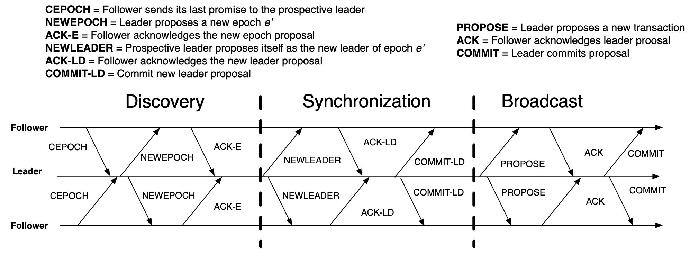

## Zab Model
### What does Zab offers?
- A crash-recovery Atomic Broadcast protocol
- Guarantees at-least-once semantics
- Implements custom "Primary order" ordering
  
#### Primary ordering
- Primary-backup replica roles
  The primary-backup nature of Zab ensures that there is only one node responsible for processing update requests and that updates are executed in a consistent order. This provides several benefits, including reduced network traffic, as updates are only broadcast to the rest of the cluster **after** they have been committed to disk by the leader, and improved reliability, as the leader node can detect if a backup node has failed and trigger a new leader election to select a new leader if necessary.
  - Primary-backup
    - [Formal definition](https://www.cs.cornell.edu/fbs/publications/DSbook.c8.pdf) of Primary-backup
  - Replicated state machine (to compare with)
    - All replicas execute all operations
    - If same start state & same opertions & same order & deterministic ==> same end state
    - *Ops* are transferred between replicas not the state
- Any replica can act as Primary
  - At most one active at a time
- Works with epochs
- State changes are called transactions (TXs)
- TXs are identified by an epoch and a counter pair (zxid)
  - zxid (64-bit long integer) = epoch (high 32 bits) | counter (long 32 bits)
    - `epoch` <a>&rarr;</a> `term` in raft
    - `counter` <a>&rarr;</a> `index` in raft
  - Ordering as follows:
    - zxid1 < zxid2 iff:
      - zxid1.epoch < zxid2.epoch
      - zxid1.epoch = zxid2.epoch && zxid1.counter < zxid2.counter
- Primary Order (PO):
  - If a primary broadcasts *m* before *m'*, then a recipient delivers *m* before *m'*
  - If two primaries broadcast two messages in different epochs, a recipient delivers them in the epoch order

## Workflow
### Discovery
`(Follower) Send last epoch number e to leader l` 

<a>&rarr;</a> `(Leader) Upon receiving messages from Quorum, propose new epch e' s.t. e' > e for all messages received in Quorum, e' = max([e1, e2, e3 ...]) + 1` 

<a>&rarr;</a> `(Follower) Upon receiving e', if e' > e, then e' = e. Reply with ACK with the highest zxid`

 <a>&rarr;</a> `(Leader) Upon receiving ACKs from Quorum, select highest zxid. Receiving missing TXs from followers (s.t. zxid' < zxid)`
### Synchronization
`(Leader) Propose NEWLEADER and send highest zxid selected` 

<a>&rarr;</a> `(Follower) Set l as the new leader. Accept TXs with zxid' < zxid. Reply with ACK` 

<a>&rarr;</a> `(Leader) Upon receiving ACKs from Quorum, send COMMIT message to all followers` 

<a>&rarr;</a> `(Follower) Upon receiving COMMIT, deliver the previously accepted TXs`
### Broadcast
`(Leader) Increment counter and propose TXs. Now zxid' > previous largest zxid` 

<a>&rarr;</a> `(Follower) Accept the TXs and reply with ACK` 

<a>&rarr;</a> `(Leader) Upon receiving ACKs from Quorum, send COMMIT message to all followers` 

<a>&rarr;</a> `(Follower) Upon receiving COMMIT, deliver the TXs`

## Comparsion with Raft
### Epoch vs. Term
  - raft.term <a>&rarr;</a> zab.epoch
  - raft: leader sends heartbeat to followers
    zab: followers send heartbeat to leader
### Leader
One of the main differences is the architecture of the protocols. 

In Zab, a designated leader node is responsible for processing update requests and broadcasting updates to the rest of the cluster. The other nodes in the cluster are considered backups and do not process update requests directly. 

In contrast, Raft uses a leader-based approach where all nodes in the cluster have the ability to propose updates and a leader node is elected through a voting process to coordinate updates.

## Exercise
#### How does Zab ensure consistency in a distributed system?
Zab ensures consistency in a distributed system by providing a total ordering of updates to the shared state. This total ordering ensures that updates are executed in the same order by all nodes in the cluster, regardless of the order in which they were received.

#### What is the process for electing a new leader in Zab when the current leader fails?
1. Detection of leader failure: When a node detects that the leader node has failed, it sends a message to the other nodes in the cluster indicating that the leader has failed.
2. Candidate selection: Once a node has received the message that the leader has failed, it can become a candidate for the role of the new leader. To become a candidate, a node must send a message to all other nodes in the cluster indicating its candidacy.
3. Voting: Once multiple nodes have become candidates, the other nodes in the cluster will vote for the new leader. Each node will cast a vote for the candidate that it believes is best suited to be the new leader.
4. Leader election: The node that receives the most votes will be elected as the new leader. Once the new leader is elected, it will send a message to all other nodes in the cluster indicating that it is the new leader.
5. Synchronization: After the new leader is elected, it will need to synchronize its state with the states of the other nodes in the cluster. This is done to ensure that the new leader has the most up-to-date view of the shared state before it begins processing updates.

#### How does Zab ensure that updates to the shared state are executed in the correct order?
Total order algorithm