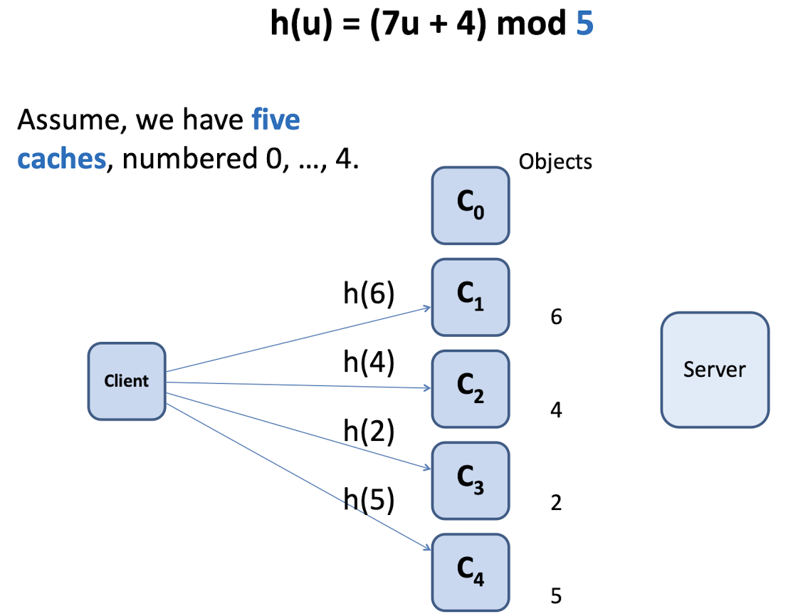
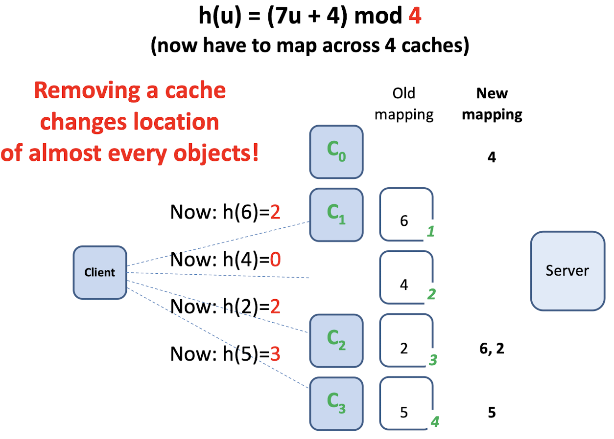
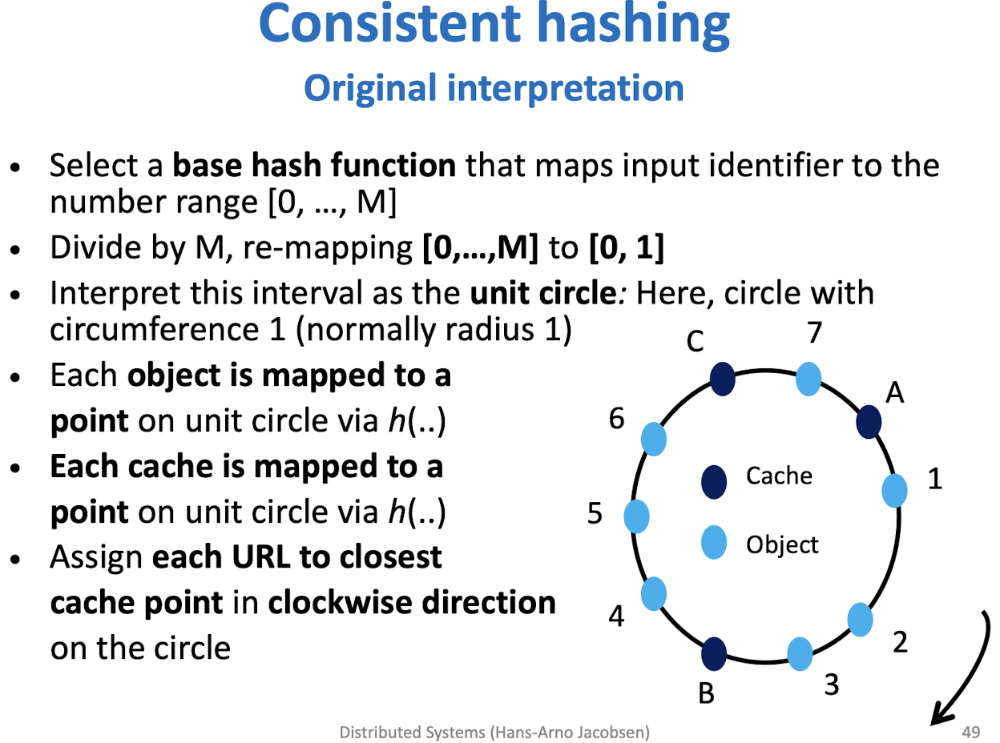
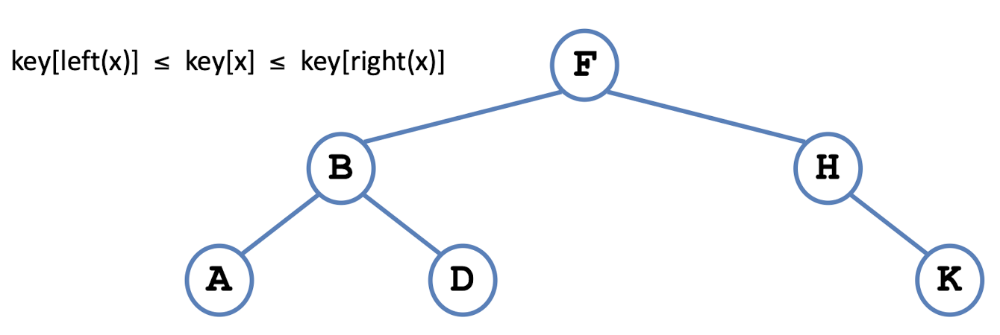
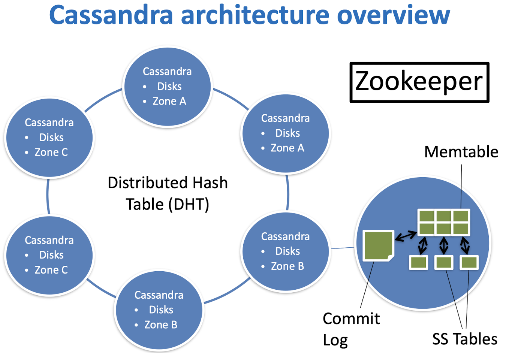
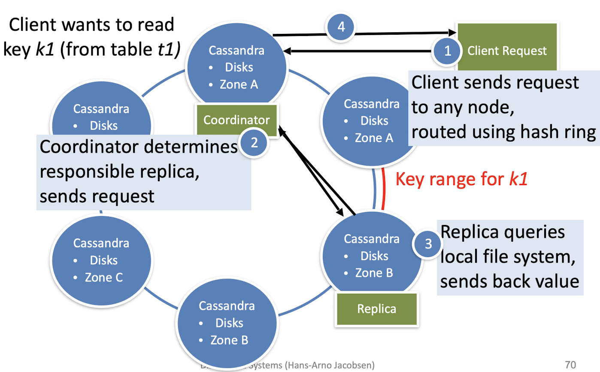
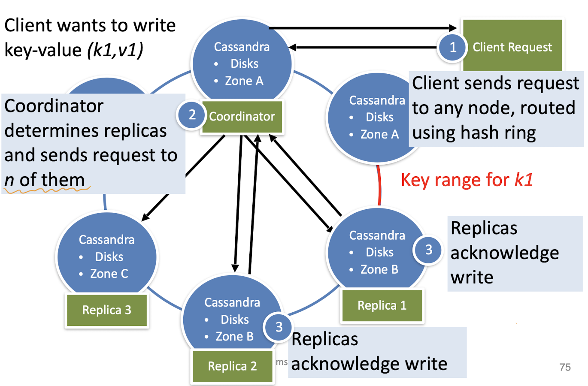
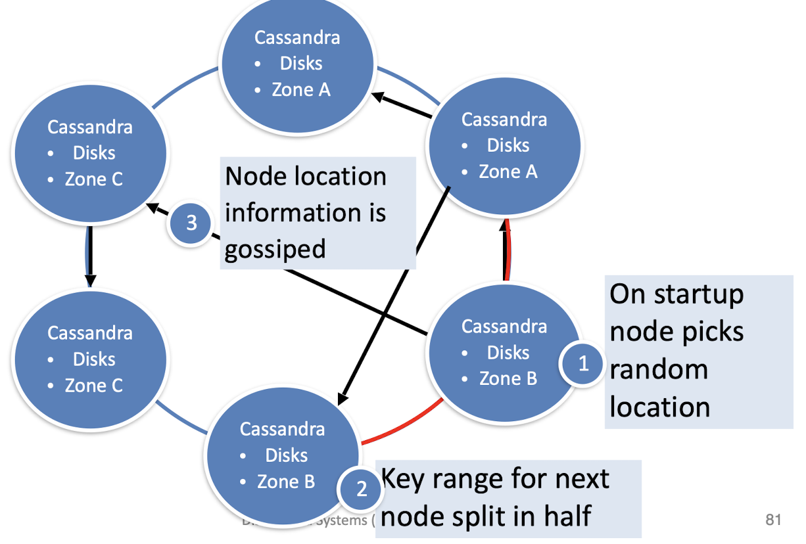
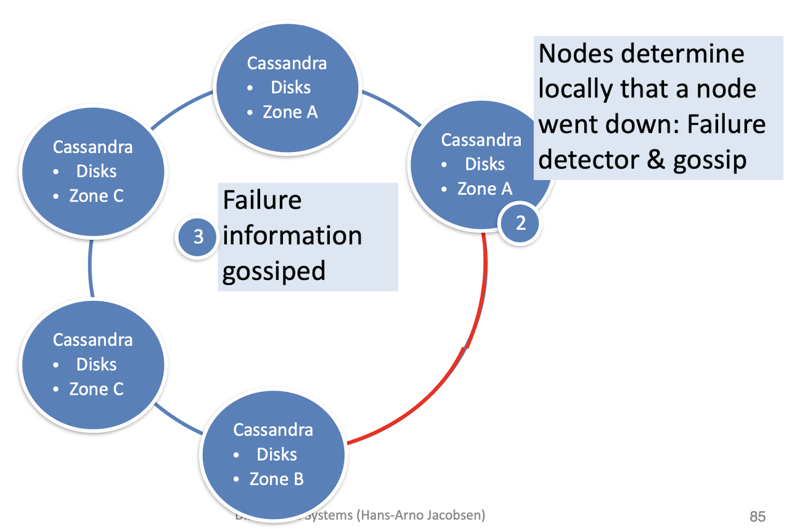

## Key-value Stores
- Container for key-value pairs (databases)
- Distributed, multi-component, systems
- KV-stores offers **simpler query semantics** in exchange for **increased scalability**, **speed**, **availability**, and **flexibility**

### Common elements of key-value stores
- Failure detection, failure recovery
- Replication
  - Store and manage multiple copies of data
- Versioning
  - Store different versions of data
  - Timestamping
  
## Consistent Hashing
There are some cache nodes working the same as CPU caches.

### Mapping objects to caches
- Each cache should carry an equal share of objects
- Horizontally partition object ID space
  
### Hashing
Hashing can satisfy the requirements above. For example, a hashing function: `h(u) = (7u + 4) mod 5 (number of cache nodes)`

### Cache node failure
If one cache node failed, the hash function need to be altered accordingly to `h(u) = (7u + 4) mod `**`4`**` (number of cache nodes)`. And the location of almost all objects need to relocated.

The same goes for adding cache nodes.

## Consistent Hashing
To allow for nodes to be added or removed without much disruption.

If a cache is removed, assign it's objects to the closest one in clockwise direction on the circle.

#### How to get the data in the crashed node since it it crashed?
On top of consistent hashing, there is a replication strategy. [More explaination here](https://stackoverflow.com/a/51610782/10016317).

### What is the key for each cache?
IP address or an unique name of the cache node.

### Lookup(key)

#### Store information about cache node via gossiping or a coordination service
Depoly ZooKeeper to create ephmeral node for each cache node and set watch flag to their parent node to track the change of nodes.

#### Cache lookup data structure at each node

Find clockwise successor of a URL point by single search in tree. (The successor of `K` is `A` in this case)

## Cassandra

### read

### write

#### The Coordinator
**What is it?** In Cassandra, a coordinator is a node in the cluster that is responsible for coordinating read and write requests from clients. When a client sends a request to the cluster, the coordinator is responsible for determining the appropriate nodes to handle the request and forwarding it to those nodes. The coordinator also collects the responses from the nodes handling the request and returns the final result to the client.

**How is it decided?** In Cassandra, the coordinator for a given request is determined by the client making the request. When a client sends a request to the Cassandra cluster, it specifies the coordinator node to handle the request. 

### add

### fail
