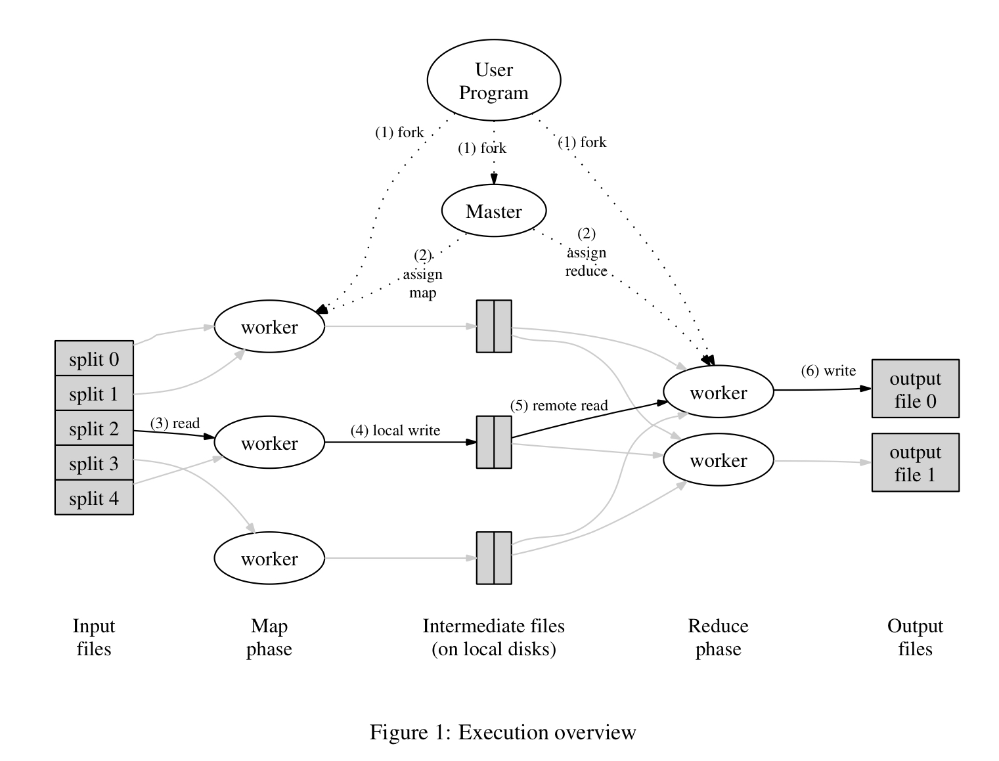

## Introduction

This article is more about my understanding and questions towards MapReduce after finishing reading the paper and implementing the lab 1 of MIT 6.824.

All contents are discussed based on the following figure from MapReduce paper.


### MapReduce Abstraction
MapReduce system hides the messy details of `parallelization`, `fault-tolerance`, `data distribution`, `load balancing` and `scheduling` (not mentioned in the paper) in a library.

Maybe in the early stage of MapReduce, `scheduling` is not a part of the library and [it is introduced later](https://www.geeksforgeeks.org/hadoop-schedulers-and-types-of-schedulers/).

MapReduce provides a **simple** and **powerful** interface that enables **automatic parallelization** and **distribution** of large-scale computations, combined with an implementation of this interface that achieves high performance on large clusters of commodity PCs.

### Data Parallelism
concurrent execution of the same task on differnet data.

## Implementation
Different implementations of MapReduce for small shared-memory machine, NUMA multi-processor machine, and networked machines are possible.

### Workflow
#### 1. Input Files
It is mentioned in the paper that the input files will usually be split into `M` pieces of typically `16` megabytes to `64` megabytes per piece **automatically**. 

##### When should it be 16 megabytes and when should it be 64 megabytes. 

My understanding is that the split is actually logic split. So, the input files are untouched but the worker will read the specified amount of data from input files. Besides, the input files are stored in Datanodes in distributed file system, like `HDFS`. So, it would be more convenient for the worker to read files stored in itself to avoid remote read of data from other nodes bringing extra network cost. Hence, we may specify a split size that reduces remote read of data in distributed file system.

#### 2. Master and Worker
There are *M* map tasks and *R* reduce tasks to assign. The master picks idle workers and assigns each one a map task or a reduce task.

#### 3 and 4. Intermediate key/value pairs
One thing mentioned in the paper is that the intermediated key/value pairs produced by the `Map` function are buffered in memory and they will be written to local disk **periodically** after partitioned by the partitioning function. To my understanding, the purpose of this is to reduce the I/O workload by writing the intermedia pairs in batch. 

#### 5. Remote Read in Reduce Phase
In my implementation of lab 1 from MIT 6.824, I have implemented a strategy to have the worker in map phase to start reduce task when it finishes the map task. I am not sure whether this is really the case in MapReduce. But, I could see one benefit of doing so is that this can reduce the need for remote read. See more [here](#jobtracker-and-tasktracker)

### Master Data Structures
- It stores the state (*idle*, *in-process*, or *completed*) of each map and reduce task
- It stores the locations and sizes of the *R* intermediate file regions produced by the map task
- It pushes the information of intermediate files to *in-process* reduce tasks

### Fault Tolerance
#### Worker Failure
The master pings every worker **periodically**. If a worker doesn't response, any Map/Reduce tasks done (in case that those intermediate files are no longer accessible) or are being processed are marked as *idle* so that the tasks will be rescheduled.

#### Master Failure
Unlike worker, the master is the one and only. So, when the master fails, when current implementation **aborts** the MapReduce computation.

#### JobTracker and TaskTracker
Quoted from [here](https://stackoverflow.com/questions/46684091/in-hadoop-what-is-the-difference-and-relationship-between-jobtracker-tasktracker) and modified.

**JobTracker**
> 1. JobTracker process runs on a separate node and not usually on a DataNode.
> 2. JobTracker is an essential Daemon for MapReduce execution in MRv1. It is replaced by ResourceManager/ApplicationMaster in MRv2.
JobTracker receives the requests for MapReduce execution from the client.
> 3. JobTracker talks to the NameNode to determine the location of the data.
> 4. JobTracker keeps track the state (*idle*, *in process*, *completed*) of each Map and Reduce task.
> 4. JobTracker finds the best TaskTracker nodes to execute tasks based on the data locality (proximity of the data) and the available slots to execute a task on a given node.
> 5. JobTracker [monitors](#worker-failure) the individual TaskTrackers and the submits back the overall status of the job back to the client.
> 6. JobTracker process is critical to the Hadoop cluster in terms of MapReduce execution.
> 7. When the JobTracker is down, HDFS will still be functional but the MapReduce execution can not be started and the existing MapReduce jobs will be halted.

**TaskTracker**
> 1. TaskTracker runs on DataNode. Mostly on all DataNodes.
> 2. TaskTracker is replaced by Node Manager in MRv2.
> 3. TaskTracker will be in [constant communication](#worker-failure) with the JobTracker signalling the progress of the task in execution.
> 4. Mapper and Reducer tasks are executed on DataNodes administered by TaskTrackers.
> 5. TaskTrackers will be assigned Mapper and Reducer tasks to execute by JobTracker.
> 6. TaskTracker failure is not considered fatal. When a TaskTracker becomes unresponsive, JobTracker will assign the task executed by the TaskTracker to another node.

### Locality
When running large MapReduce operations on a significant fraction of the workers in a cluster, most input data is **read locally** and consumes no network bandwidth.

### Output Files
Since the reduce task worker will write the results in many seperate files and sometimes we need to gather the results all together. In hadoop system, you can run the following command. `hadoop fs -getmerge /output/dir/on/hdfs/ /desired/local/output/file.txt`

### Task Granularity
We have *M* map tasks and *R* reduce tasks. *M + R* should be ideally much larger than the number of worker machines.

Having each worker perform many different tasks improves dynamic load balancing, and also speeds up recovery when a worker fails.

### Backup Task
`straggler`: a machine that takes an unusually long time to complete one of the last few map or reduce tasks in the computation.

When a MapReduce operation is close to completion, the master schedules backup executions of the remaining in-progress tasks. The task is marked as completed whenever either the primary or the backup execution completes.

## Refinements

### Combiner Function
We allow the user to specify an optional *Combiner* function that does **partial merging** of this data before it is sent over the network.

The *Combiner* function is executed on each machine that performs a map task. Typically, *Combiner* and *Reduce* have the same codes. The only difference is how the `MapReduce` library handles the output of the function.

### Input and Output Types
Input data formats:
- "text" mode: treat each line as a key/value pair
- A sequence of key/value pairs sorted by key

User can implement a simple *reader* interface to support for a new type.

### Skipping Bad Records
MapReduce provides an optional mode of execution where the library detects which records cause deterministic crashes and skips these records in order to make forward progress.

Each worker process installs a **signal handler** that catches segmentation violations and bus errors. Before invoking a user *Map* or *Reduce* operation, the MapReduce library stores the sequence number of the argument in a global variable. 

### Local Execution
An alternative implementation of the MapReduce library that **sequentially** executes **all** of the work for a MapReduce operation on the local machine to facilitate debugging, profiling, and small-scale testing.

## Examples

#### Distributed Grep
```
map -> a line that matches the given pattern
reduce -> simply copy the output of map
```

#### Count of URL Access Frequency
```
map -> <URL, 1>
reduce -> <URL, total count>
```

#### Reverse Web-Link Graph
```
map -> <target, source> (each link to a target URL found in a page named source)
reduce -> <target, list(source)>
```

#### Term-Vector per Host
```
map -> <hostname, term vector>
reduce -> <hostname, term vector> (throwing away infrequent terms)

term vector = a list of <word, frequency>
```

#### Inverted Index
```
map -> <word, document ID>
reduce -> <word, list(document ID)>
```