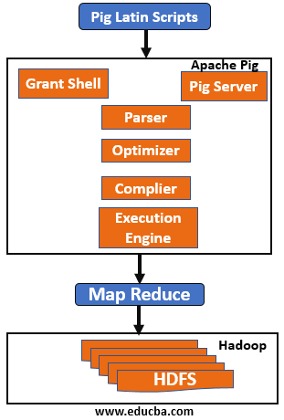
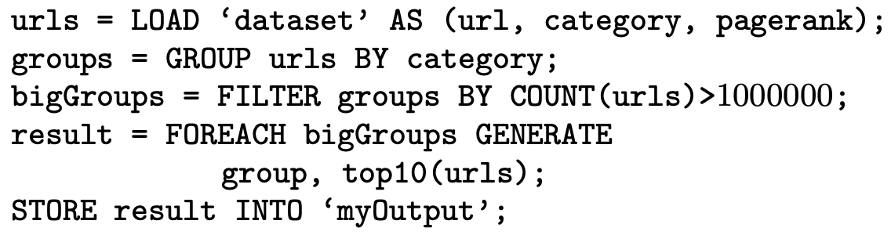
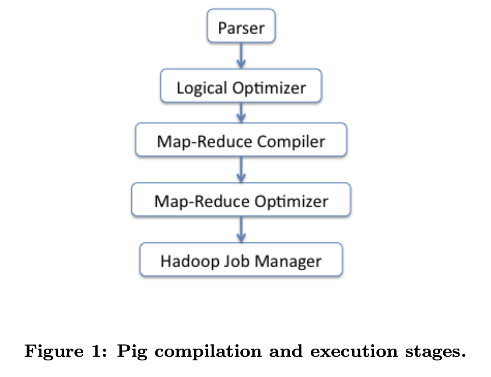
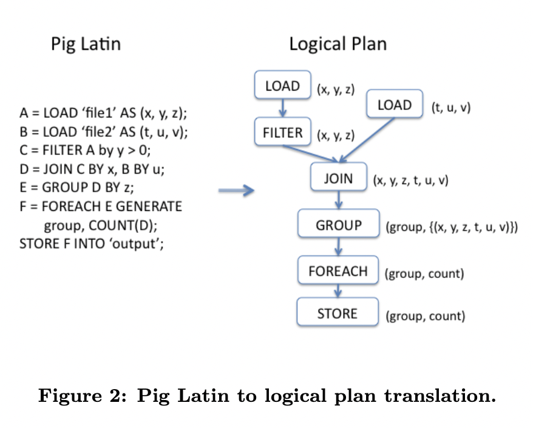
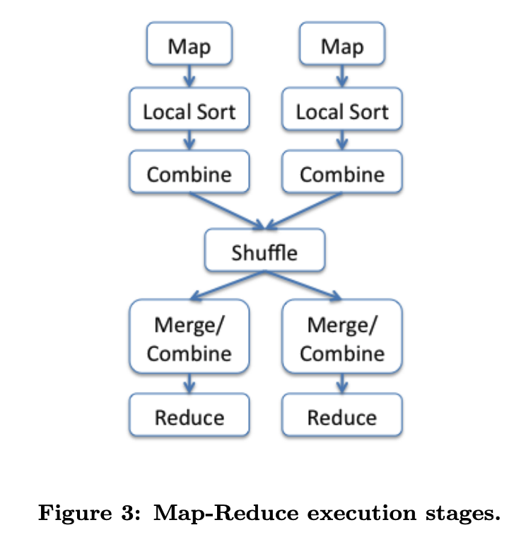
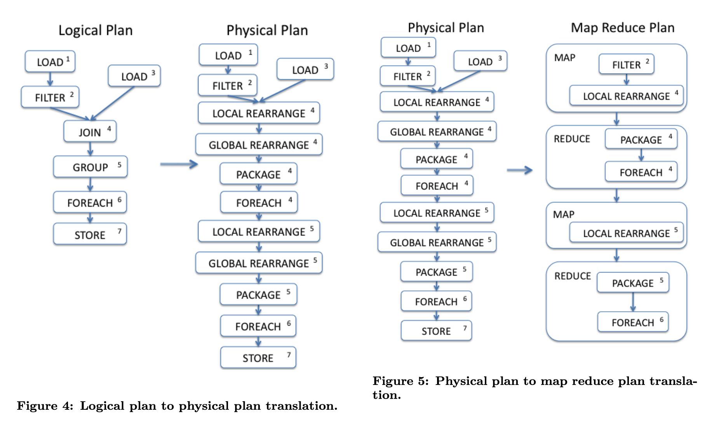
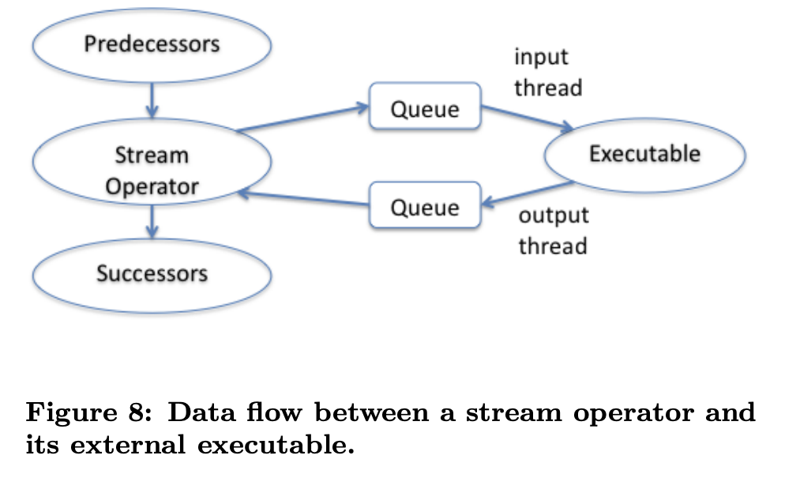

This is the notes for reading the paper, *Building a High-Level Dataflow System on top of MapReduce: The Pig Experience*.

### The Limitations of MapReduce
- No support for complex N-step dataflows
- Lack of explicit support for combined processing of multiple data sets
- Low-level abstraction from common data analysis tasks: frequently-needed data manipulation primitives must be coded by hand
- Graph algorithm
- Iterative algorithm: processing data again and again, e.g. k-means
- Stream processing - Low latency

### What *Pig* System offers
> Our Pig system offers composable high-level data manipulation constructs in the spirit of SQL, while at the same time retaining the properties of Map-Reduce systems that make them attractive for certain users, data types, and workloads.

Pig abstracts the low-level primitive into some commonly used operations. For example, in data analysis task, `filter`, `join`, `group-by` and `sort` built upon MapReduce are provided by Pig.

`Pig Latin = SQL-kind queries + Distributed execution(MapReduce)`

### System Overview
`Pig Lation Program -> One or more MapReduce jobs -> Execute the jobs on a given hadoop cluster`

#### Features

> From the example above:
> - a step-by-step dataflow language where computation steps are chained together through the use of variables
> - the use of high-level transformations, e.g., `GROUP`, `FILTER`
> - the use of user-defined functions as first-class citizens

#### Three modes of user interaction
##### Interactive Mode
The user interacts with Pig through an shell (called *Grunt*) by typing Pig command. **The compilation and execution is triggered only when the user asks for output through SOTRE command**

##### Batch Mode
The difference between this mode and interactive mode is that the user can submit a script containing Pig commands.

##### Embeded Mode
Pig offers a Java library. This option permits dynamic construction of Pig Latin programs, as well as dynamic control flow.

#### Command Transformation

A Pig programm goes through a series of transformation steps before being executed.

#### Parsing
The parser checks the syntactical correctness of the program, validity of all referenced variables, type, schema inference, and other checks.

The output of the parser is a logical plan organised in a directed acyclic graph ([DAG](https://en.wikipedia.org/wiki/Directed_acyclic_graph)) with a **one-to-one correspondence** between Pig Latin statements and logical operators

#### Logical Optimizer
In this stage, the **logical operators** will be optimized by a *logical optimizer*, such as [projection pushdown](https://towardsdatascience.com/predicate-vs-projection-pushdown-in-spark-3-ac24c4d11855). Then they will be compiled into a series of Map-Reduce jobs.

#### Map-Reduce Compiler
The optimized logical plan is then compiled into a series of Map-Reduce jobs.

#### Map-Reduce Optimizer
Optimization based on Map-Reduce *[combiner](./2023-1-3-Mapreduce%20reading%20notes.md#Combiner-Function)* stage to perform early partial aggregation.

In the end, the DAG of optimized Map-Reduce jobs is topologically sorted and ready to be executed by Hadoop in that order.

### Type System and Type Inference
Standard scalar types: `int, long, double and chararray (string), and bytearray`
Complex types: `map, tuple, and bag`
- map: `key - chararray, value - any type`
- tuple: an order list of data elements (can be any types, even nesting of complex types)
- bag: a collection of tuples

#### Type Declaration
1. no data types are declared. Treat all files as `bytearray` in this case. If the program uses an operator that expects a certain type on a field, then Pig will coerce that field to be of that type. Another case where Pig is able to know the type of a field even when the program has not declared types is when operators or user-defined functions (UDFs) have been applied whose return type is known.

2. declare types explicitly during LOAD as part of the AS clause

3. declaring types is for the load function itself to provide the schema information, which accommodates self-describing data formats such as JSON.

#### Lazy Conversion
When Pig does need to cast a `bytearray` to another type because the program applies a type-specific operator, it delays that cast to the point where it is actually necessary.

### Compilation to Map-Reduce
From logical plan to Map-Reduce execution plan.

`Logical Plan -> Physical Plan -> MapReduce Plan`

This is done by the MapReduce compiler??

#### Logical Plan Structure
The work of [parser](#parsing).

Pig currently performs a limited suite of logical optimizations to transform the logical plan, before the compilation into a Map-Reduce plan.

#### Map-Reduce Execution Model

The execution stages of a hadoop MapReduce job.
1. **Map Stage**. `Map` stage process the raw input data one by one and produces a stream of data items annotated with keys.
2. **Local Sort**. To sort the data from map stage by key
3. **Combine**. This is an optional stage. It is for partial aggregation.
4. **Shuffle Stage**. Redistribute data among manchines to achieve a global organization of data by key.
5. **Merge/Combine**. A single ordered stream in merge stage and a possible combiner after each intermediate merge step.
6. **Reduce Stage**. Process the data associated with each key in turn, often performing some sort of aggregation.

#### Logical-to-Map-Reduce Compilation
Pig first translates a logical plan into a physical plan, and then embeds each physical operator inside a Map-Reduce stage to arrive at a Map-Reduce plan.

##### Logical Plan -> Physical Plan
`GROUP` -> `local rearrange, global rearrange, and package`. Rearrange means either hashing or sorting by key.

`JOIN` -> (1) `COGROUP` followed by a `FOREACH` operator to perform "flattening" (2) fragment-replicate join

##### Physical Plan -> Hadoop stages
Local rearrange operator simple annotates tuples with keys and stream identifiers, and let the Hadoop local sort stage do the work.

Golbal rearrange operators are removed because their logic is implemented by the Hadoop shuffle and merge stage.

Load and store are also removed, because the Hadoop framework takes care of reading and writing data.

##### Branching Plans
If a Pig Latin program contains more than one `STORE` command, the generated physical plan contains a `SPLIT` physical operator.

### Map-Reduce Optimization and Job Generation
Only one optimization is carried at this level: Pig breaks *distributive* and *algebraic* aggregation functions into a series of three steps: `initial`, `intermediate`, and `final`. These steps are assigned to the `map`, `combine`, and `reduce` stages respectively.

The final step generates a Java jar file that contains the Map and Reduce implementation classes, as well as any user-defined functions that will be invoke as part of the job.

## Plan Execution
### Flow Control
[Iterator model](https://en.wikipedia.org/wiki/Iterator_pattern)
> Advantages:
> - simple single-threaded implementation that avoids context-switching overhead.
> - it leads to simple APIs for user-defined functions

> Disadvantages:
> - see the paper

### Memory Management
Java doesn't allow the developer to control memory allocation and deallocation directly.

In practice it is generally better to return an “out-of-memory” error so that an administrator can adjust the memory management parameters and re-submit the program, compared to getting mired in long periods of thrashing that may go undetected.

Most memory overflow situations in Pig arise due to materialization of large bags of tuples between and inside operators, and our memory management approach focuses on dealing with large bags.

Pig uses Java’s MemoryPoolMXBean class to be notified of a low memory situation. 

Pig’s memory manager maintains a list of all Pig bags
created in the same JVM, using a linked list of Java
WeakReferences

## Streaming
Streaming allows data to be pushed through external executables (User-defined functions) as part of a Pig data processing pipeline.

Streaming executables receive their input from standard input or a file, and write output either to standard output or to a file.

