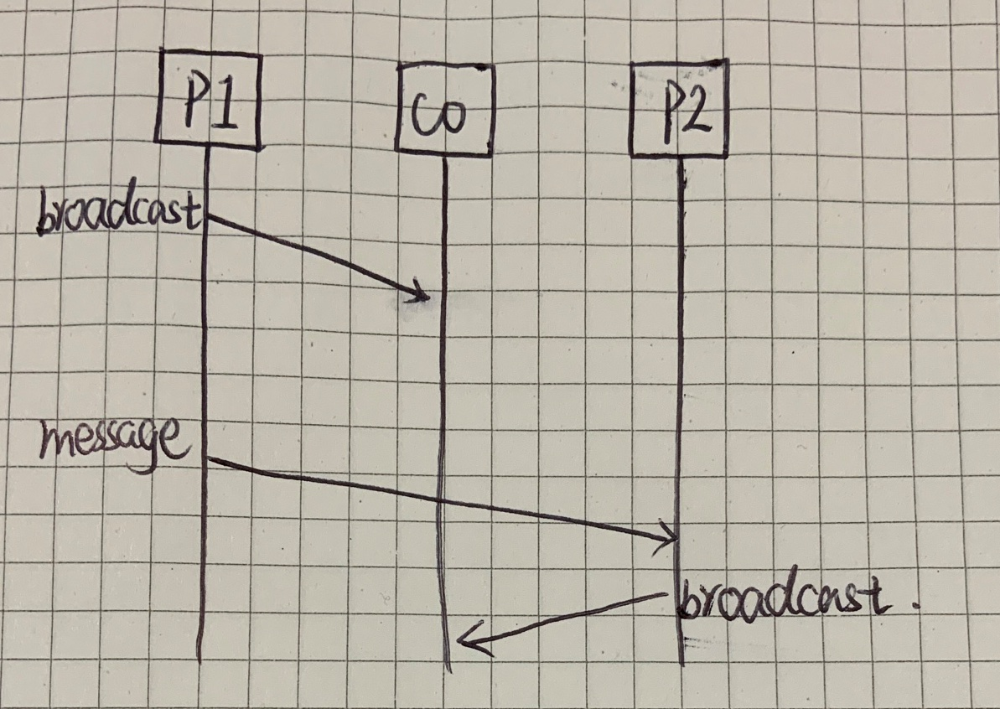

## Overview

## Questions
### 1. Why does FIFO-total order broadcast imply Causal broadcast?

> For this algorithm, total ordering follows immediately from FIFO ordering on broadcasts by the coordinator. If we assume the messages to the coordinate travel along FIFO point-to-point channels, we also get single-source FIFO for each process. 
> 
> **In general we do not get causal ordering unless the only communication is by broadcast**: if `P1` sends a broadcast to the coordinate and then a message to `P2`, and `P2` responds to this message by itself sending a broadcast to the `coordinator`, then the two broadcasts are causally related but there is no guarantee which arrives at the coordinator first. 
> 
> On the other hand, if the only way that `P1` and `P2` communicate is through broadcasts, then any broadcast of `P1` that happens-before some broadcast of `P2` must be connected by a chain of intermediate broadcasts that left the coordinator before `P2's` broadcast arrived; so **in this case we do get causal ordering**.
> -- <cite>https://www.cs.yale.edu/homes/aspnes/pinewiki/Broadcast.html</cite>

It is assumed here that **single leader approach** is deployed to have total order broadcast.

The first case is as follows.

`P1 broadcast`$\rArr$`P2 broadcast`
The P2P message won't go through the `coordinator`. So, it is possible that `P2's` broadcast arrives at the `coordinator` earilier than `P1's` due to some possible network issues. In this case, there is no causality between broadcasts.

However, in the second case as follows.

`P1 broadcast`$\rArr$`P2 broadcast`
The broadcast from `P2` can only start after the broadcast from `P1` (or possbile some more intermediate broadcasts) being delivered to `P2`. Hence, causality is conserved. 

### 2. Why does Total order broadcast not imply Causal broadcast?
Let's take a look at the scenario in the figure below.

`b` stands for *broadcast* here.

The causality is `b1` $\rArr$ `b2` $\rArr$ `b3`. So, we have `b1` $\rArr$ `b3`.

In single leader total order broadcast, the causality of `b2` $\rArr$ `b3` can still be preserved the same as FIFO-total order broadcast. 

However, `b1` $\rArr$ `b2` is not guaranteed since there is no FIFO order guaranteed in total order broadcast; `b1` and `b2` can be reordered, which also means `b1` $\rArr$ `b3` is not guaranteed. Meanwhile, they are guaranteed by FIFO-total order.

So, total order does not imply causal order.