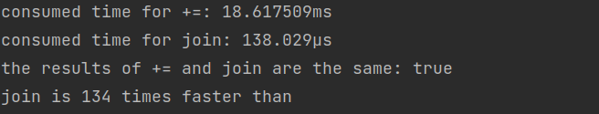

## Chapter 01

### 02
##### `+=` is less efficient than `Join` in `strings` package
`+=` will create a new string and assign it to the left variable. 
``` s += "test" ```
Thus, the old value in the left variable needs to be relased and the memory space of it should be recycled at the right time. So, when the size of strings needed to be connected is huge, `Join` has a better performance than `+=`

|  | 
|:--:| 
| *Connecting string a for 10000 times* |

An [explanation](https://stackoverflow.com/a/39312172) in detail for the same thing in `Python`. I guess this applies for `Go` as well.

### 03
###### the iteration order of map is not fixed
This design is on purpose so that the program cannot rely on a specific iteration order. [Here](https://stackoverflow.com/questions/11853396/google-go-lang-assignment-order) for more specific explanation.

##### the verbs for printf
```
%d          decimal integer
%x, %o, %b  hexadecimal, octal, binary
%f, %g, %e  floating point： 3.141593 3.141593e+00
%t          bool：true or false
%c          char(rune)(Unicode)
%s          string
%q          string with double quote "abc" 
            or char with single quote 'c'
%v          natual format of a varible
%T          type of varible
%%          %
```
### 06
##### goroutine and channel
when a go routine tries to send through or receive from a `channel`, this go routine will be blocked until the other end of the channel has finished receiving or sending.

##### int to string
Type cast doesn't work well, `string(i)`. Recommened way: `strconv.Itoa(i)` from package `strconv`. More methods [here](https://stackoverflow.com/a/29841190).

But why doesn't type cast from int to string (`string(i)`) work? It has something to do with the [underlying type and assignability](https://medium.com/golangspec/conversions-in-go-4301e8d84067) in `Go`.

### 07
##### a quick way to handle err
```
if err := r.ParseForm(); err != nil {
	log.Print(err)
}
```

##### query in http
A http url like this `http://localhost:8000/?cycles=20` means that after the question mark you can pass key-value pairs and use them in the server side.

In `GO`, the way to get query is `cycles, _ = strconv.Atoi(r.URL.Query().Get("cycles"))`, `r` is a `httpRequest` object.

## Chapter 02
### 03
##### short variable declaration

In short varible declaration, there should be at least one new variable.
```
f, err := os.Open(infile)
// ...
f, err := os.Create(outfile) // compile error: no new variables
```
the correct one
<pre>
f, err := os.Open(infile)
// ...
f, err <b>=</b> os.Create(outfile) // compile error: no new variables
</pre>

##### pointer
In `Go`, it's safe to return a pointer to a local varible.
```
var p = f()

func f() *int {
	v := 1
	return &v
}
```

the pointer-based package, `flag` to handle the parameter in command line.

##### life span of a varible
The garbage collector in `Go` decides when a varible can be recycled based on whether this variable is still accessible with the pointer or reference. ???

##### stack or heap
In `Go`, the compiler decides where a varible is stored. Unlike `C/c++`, `var` and `new` don't have a say in this matter.

```
var global *int

func f() {
	var x int
	x = 1
	global = &x
}

func g() {
	y := new(int)
	*y = 1
}
```
varible `x` in function `f` is allocated on `heap`. `*y` in function `g` can be allocated on `stack` or on `heap`

### 04

##### tuple assignment
```
x, y = y, x
a[i], a[j] = a[j], a[i]
```

##### assignability


### 05
##### type
`type typeName underlyingTypeName`

```
// Package tempconv performs Celsius and Fahrenheit temperature computations.
package tempconv

import "fmt"

type Celsius float64    // 摄氏温度
type Fahrenheit float64 // 华氏温度

const (
	AbsoluteZeroC Celsius = -273.15 // 绝对零度
	FreezingC     Celsius = 0       // 结冰点温度
	BoilingC      Celsius = 100     // 沸水温度
)

func CToF(c Celsius) Fahrenheit { return Fahrenheit(c*9/5 + 32) }

func FToC(f Fahrenheit) Celsius { return Celsius((f - 32) * 5 / 9) }
```
`Celsius` and `Fahrenheit` in this example are **not** comparable.

`T(x)` to convert `x` to type `T`. Only when the underlying type are the same, can the conversion work. This is also talked about [here](#int-to-string).

```
func (c Celsius) String() string { return fmt.Sprintf("%g°C", c) }

c := FToC(212.0)
fmt.Println(c.String()) // "100°C"
fmt.Printf("%v\n", c)   // "100°C"; no need to call String explicitly
fmt.Printf("%s\n", c)   // "100°C"
fmt.Println(c)          // "100°C"
fmt.Printf("%g\n", c)   // "100"; does not call String
fmt.Println(float64(c)) // "100"; does not call String
```
when `func (c Celsius) String() string` is disabled.
```
fmt.Printf("%v\n", c)   // 100
fmt.Printf("%s\n", c)   // %!s(main.Celsius=100)
fmt.Println(c)          // 100
fmt.Printf("%g\n", c)   // 100
fmt.Println(float64(c)) // 100
```

### 06
##### name exportation
when a name (variable name, function name) begins with captical letter, then it's exported.

### exercise
##### Hamming weight
A very fast way to do bit population count. https://en.wikipedia.org/wiki/Hamming_weight

## Chapter 03

### 01
##### Integer
Signed integer: `int8`, `int16`, `int32` and `int64`
Unsigned integer: `uint8`, `uint16`, `uint32` and `uint64`

The sizes of `int` and `uint` are based on the platform.

`rune` = `int32` to represent a Unicode.
`byte` = `int8` to represent a raw data.

`uintptr` is a kind of unsigned integer for pointer.

```
medals := []string{"gold", "silver", "bronze"}
for i := len(medals) - 1; i >= 0; i-- {
	fmt.Println(medals[i]) // "bronze", "silver", "gold"
}
```
In this case, if `i` is unsigned, this `for-loop` will never end. Hence, unsigned integers are often used in bit operation or other special cases.

Any integer can be wriiten in Octal `0666` or hex `0x666/0X666`

```
o := 0666
fmt.Printf("%d %[1]o %#[1]o\n", o) // "438 666 0666"
x := int64(0xdeadbeef)
fmt.Printf("%d %[1]x %#[1]x %#[1]X\n", x)	// trick here
// Output:
// 3735928559 deadbeef 0xdeadbeef 0XDEADBEEF
```
`[1]` tell Printf function to reuse the first parameter.

### 02
##### Floating Point
`float32` and `float64`: 32-bit floating point and 64-bit floating point

```
func compute() (value float64, ok bool) {
	// ...
	if failed {
		return 0, false
	}
	return result, true
}
```
How to deal the possible failure of function returning floating point

### 03
##### Complex
`complex64` and `complex128`

##### String
Append Only
```
s := "left foot"
s[0] = 'L' // Illegal
```
So that the correctness of the case in the figure is guaranteed.
