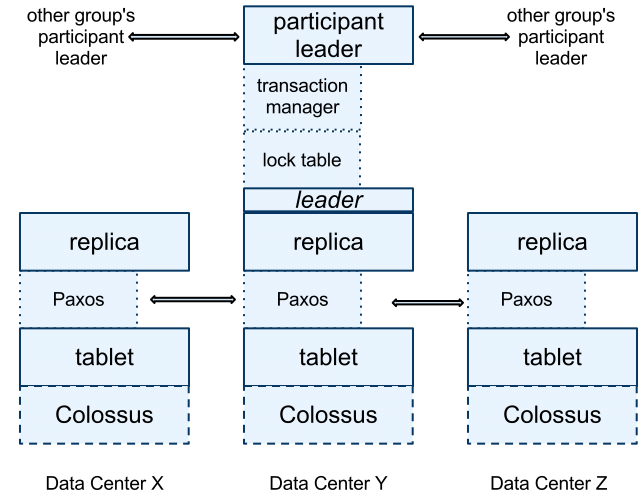
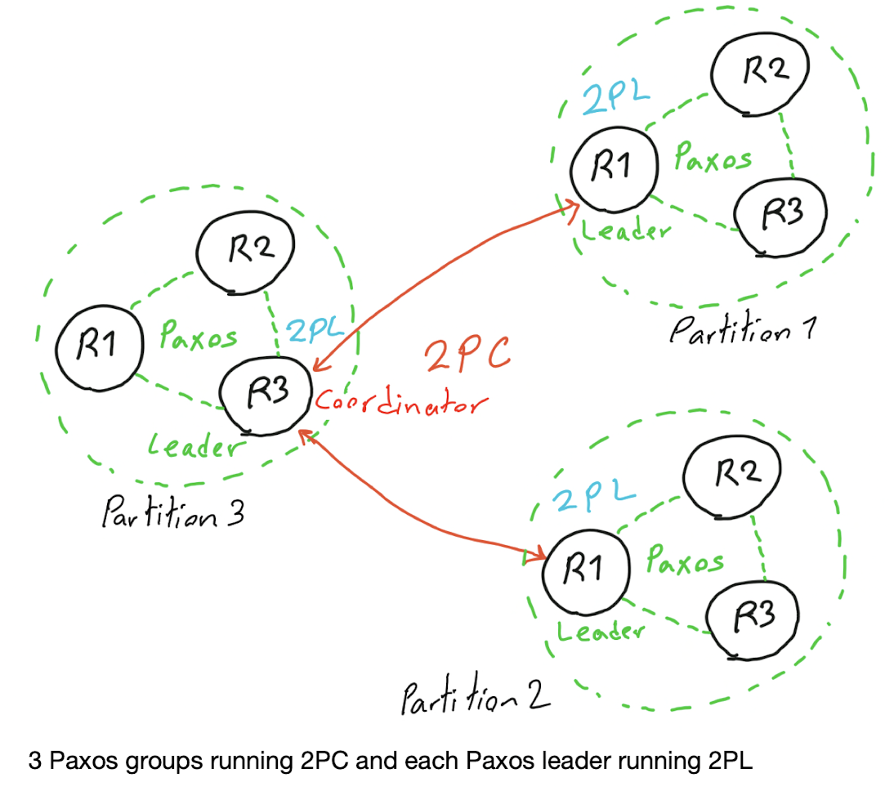

## Spanner Software Stack

## Spanner's recipe
- state machine replication within a shard
- Two-phase locking for serialization
- Two-phase commit for distributed transactions or cross-shard transactions
- Multi-version database systems
- Snapshot isolation

## Key idea: Synchronize snapshots
External Consistency: Commit order respects global wall-time order

## TrueTime
`TrueTime.now()` returns an time interval `[TT.now().earliest(), TT.now().lastest()]`

### Commit Wait
In 2PL, the transaction first acquires locks and the release the locks. The timestamp `s` is chosen between the time of acquiring locks (Ta) and the time of releasing locks Tr as the timestamp of the transaction. The timestamp `s` should satisfy `T``a``.lastest() < s < T``r``.eariliest()`

## 2PC and Paxos

In Paxos algoritm, the leader commits first and then the rest follow. So, now all leaders running 2PC can make sure every event is atomically committed or aborted on leaders. Not every event needs to be committed for all, for example, I followed someone on Instagram. This only need to be carried out in the group where my data is held, but If I delete someone as my friend, this should happened in all servers containing my data and my friend’s data

By only accessing leaders and running 2PL we guarantee that we achieve a serialization order that respects the real-time order of the transactions. 

In spanner,  
> if a transaction *Ti* commits before another transaction *Tj*, then the timestamp of *Ti* is smaller than *Ti's*.

That is, the external consistency is achieved by ensuring the consistency of the scheduling order and CommitTS on top of serializability. 

#### But how is the fact that the *Ti* commits before *Tj* decided?
I think this the meaning of serialzability. Serializability allows for concurrent operations, but it ensures that the result of these operations is the same as if they were executed serially, which helps to preserve the consistency of the database. The order is given in a way to preserve the serializability.

#### connection between 2PL and Paxos
**2PL provides a sequence of transaction with respect to the global time with the leader of each paxos group participating. Then, the leader will carry out the transactions in that order.** In Spanner, two-phase locking (2PL) provides a sequence of operations that respects the global time order, as determined by the TrueTime API. The Paxos-based commit protocol then ensures that the operations are executed in this order, even in the presence of node failures, to provide a globally consistent view of the database.

## Questions
[Reference](http://nil.csail.mit.edu/6.824/2021/papers/spanner-faq.txt)

### How does external consistency relate to linearizability and serializability?

External consistency seems to be equivalent to linearizability, but applied to entire transactions rather than individual reads and writes. External consistency also seems equivalent to strict serializability, which is serializability with the added constraint that the equivalent serial order must obey real time order. The critical property is that if transaction T1 completes, and then (afterwards in real time) transaction T2 starts, T2 must see T1's writes.

### Why is external consistency desirable?

Suppose Hatshepsut changes the password on an account shared by her workgroup, via a web server in a datacenter in San Jose. She whispers the new password over the cubicle wall to her colleage Cassandra. Cassandra logs into the account via a web server in a different datacenter, in San Mateo. External consistency guarantees that Cassandra will observe the change to the password, and not, for example, see a stale replica.

### How is external consistency guaranteed?
1. **GPS-based TrueTime API**: Spanner uses GPS signals and atomic clocks to provide a globally consistent time across all nodes in the system. This allows it to assign global timestamps to transactions and use these timestamps to order updates to the database, ensuring that all nodes in the system agree on the order of updates.
2. **Paxos-based commit protocol**: Spanner uses a Paxos-based commit protocol to ensure that transactions are committed to the database in a globally consistent order, even in the presence of node failures. The commit protocol ensures that a transaction is considered committed only if a majority of nodes in the system agree that it has been committed.
3. **Two-phase locking**: Spanner uses two-phase locking to ensure that transactions are executed in a way that respects the global order of updates, and to prevent conflicts between transactions that are trying to update the same data.

### What is the pupose of Spanner's commit wait?

Commit wait ensures that a read/write transaction does not complete until the time in its timestamp is guaranteed to have passed. That means that a read/only transaction that starts after the read/write transaction completes is guaranteed to have a higher timestamp, and thus to see the read/write transaction's writes. This helps fulfil the guarantee of external consistency: if T1 completes before T2 starts, T2 will come after T1 in the equivalent serial order (i.e. T2 will see T1's writes).

### Difference on how transactions are ordered between Raft and Spanner
In Raft, we have `<term, index>` pair to provide total order of transactions. The `<term, index>` is proposed by each node. There is the election process to provide the basis of ordering.

While in sapnner, the order is given by `2PL`. 

Further question:
Let's treat paxos as raft for simplicity here.
#### How dose raft in spanner running?
Since, the order of events is given by `2PL`. So, **is there still a `<term, index>` in raft**? If not, **how is the leader election/failure handled?**