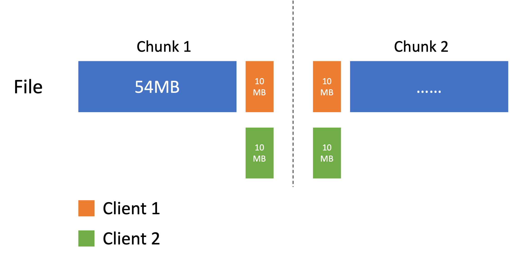
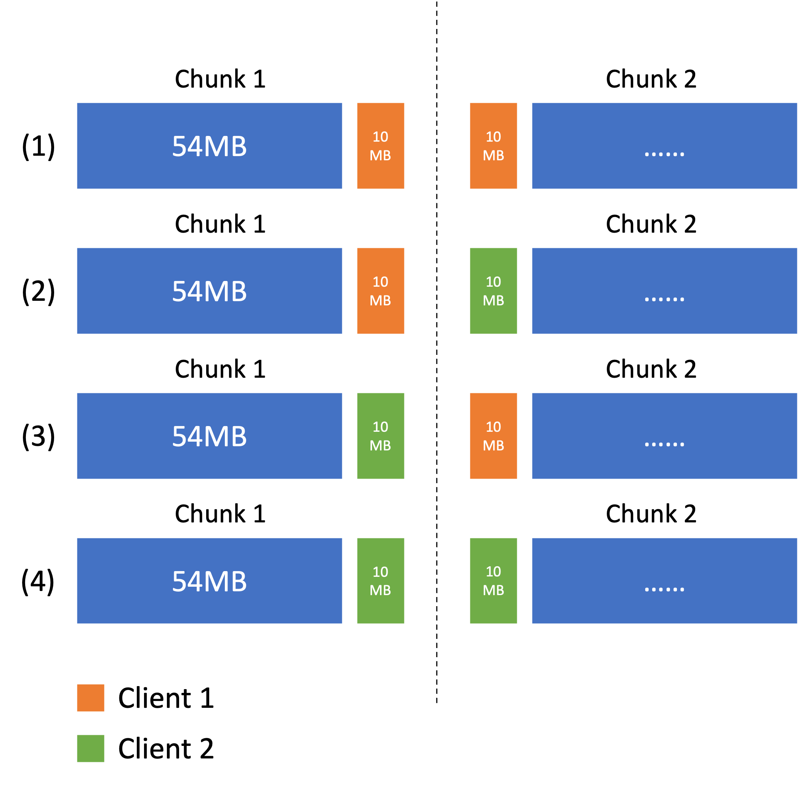
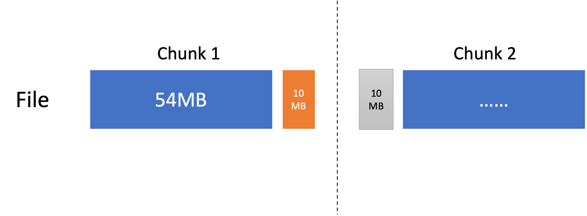
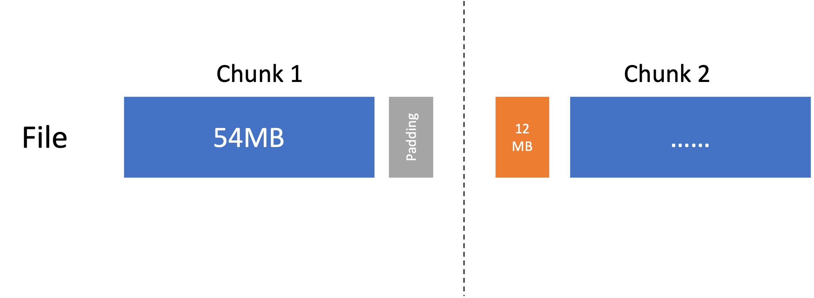

## Introduction
In section `3.1` of GFS paper where the write control and data flow is discussed, it is mentioned that the `primary` replica can serialize the requests when there are multiple requests at the same time.

> The primary assigns consecutive serial numbers to all the mutations it receives, possibly from multiple clients, which provides the necessary **serialization**.

However, in section `3.3` it is also mentioned that concurrent writes to the same region are not serializable.

> Concurrent writes to the same region are not serializable: the region may end up containing data fragments from multiple clients.

So, **are concurrent writes serializable or not?** And this question will lead us to GFS's atomicity in the end.

## The difference between `write` and `record append`
`Write` and `record append` are discussed in [the previous blog](2023-1-23-GFS.md). One difference is how they handle the case where the updated data region spans across more than one chunk. We will look into this difference through some cases.

#### Case 1


Both `client 1` and `client 2` want to write to the same `file` which consists of `2` chunks. The `write` requests starts at offset of `54MB` and the data length is `20MB`, `write(54MB, 20MB)`, as described in the figure above.

Now, each `write` request have to be split into `2`.

`write 20MB` = `write 10MB at the end of chunk 1` + `write 10MB at the start of chunk 2`

Each chunk has its own `primary` replica at each update request and **`primary` replica only serializes the requests on this chunk.**, which means the above case can end in the following 4 results.


In `(2)` and `(3)`, the final state of the chunks is neither wanted by `client 1` nor `client 2`. Hence, they are **not atomic** to `client 1` or `client 2` since only **part of the write** request is successed.

#### Case 2


This time only one client send the same write request as that in case 1. However, the write on `chunk 2` failed. So, only part of the write request succeed. Hence, it is not atomic.

#### Case 3
One client tried to append 12MB data at the offset of 54MB. Different from write request, append will first pad the first chunk to 64MB and write entire 12MB data in the second chunk.


`Record append` adopts this strategy to avoid the situation that some part the request is succeed and the other part failed.

### Summary
With the lock mechanism in maste and lease mechanism, A `write` request happening *on one single chunk* is guaranteed to be **atomic**. However, a `write` request in GFS might be split into *multiple requests*. In this case, GFS cannot guarantee the writes on *multiple chunks* all succeed or all fail. 

The reason why `record append` is label being **atomic** is that GFS guarantees that `record append` won't be split into multiple request and hence `record append` either succeeds completely or fails completely.

## No atomicity among replicas
There is no atomicity among a chunk's replicas: An update request succeeds if all replicas return success; if fails as long as at least 1 replica returns failure (some replica succeed, some not).

The failed request can result in the following cases:
- the client will retry `write request` on failure until the request succeeds. However, if some replicas crash before the retrial, then the inconsistency becomes permanent.
- the client will retry `record append` on failure as well. However, `record append`'s retrial happens after the failed last-time record. This brings permanent inconsistency and replications of the same record. The client reties until the request returns success.

From the above, we can arrive at the conclusion that **atomic record append is at-least-once**.

### Exercise
Design a protocol for GFS to support atomic write.

*atomic_update(filename, offset, length, data)*

The *atomic_update* interface should ensure that the entire *data* from a client is written atomically in the give file at the specified *offset*, even if the *length* of the *data* spans across multiple chunks in the GFS filesystem. [Simplifing assumption: A simple file-level synchronisation protocol assuming non-faulty clients is sufficient.]

---
```python
if the request does not span across multiple chunks
   write(filename, offset, length, data) # a normal write
else
   split data into segments [segment_0, segment_1]
   write(filename, offset, len(segment_0), segment_0)
   offset_seg = append(filename, len(segment_0), segment_1)
```
There is not way to guarantee atomicity when write spans across chunks using `write` as discussed [above](#case-1). However, `record append` is at-least-once atomic. So, the part of data can be held in the first chunk are written in the normal `write` way since `write` provide atomicity within a chunk. The part in next chunk is updated by `record append`. This way, it is guaranteed that the second part will be successfully written into the second chunk. However, some measurements need to be taken to handle the offset returned by `record append`.

## Reference
- [《分布式系统与一致性》](https://book.douban.com/subject/35466098/)
- [Slides from University of Toronto](../assets/img/GFS/3-gfs-slides.pdf) 