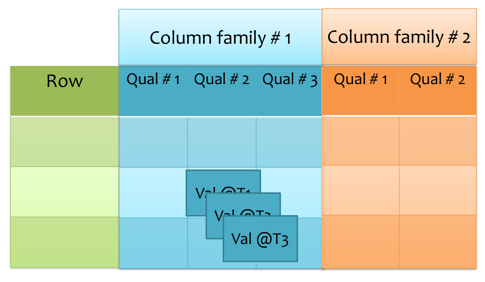
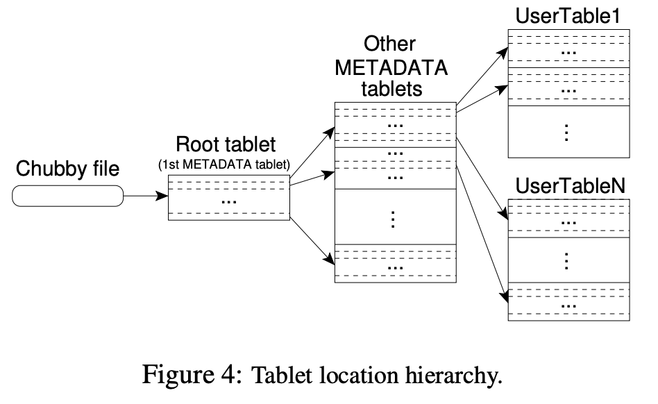
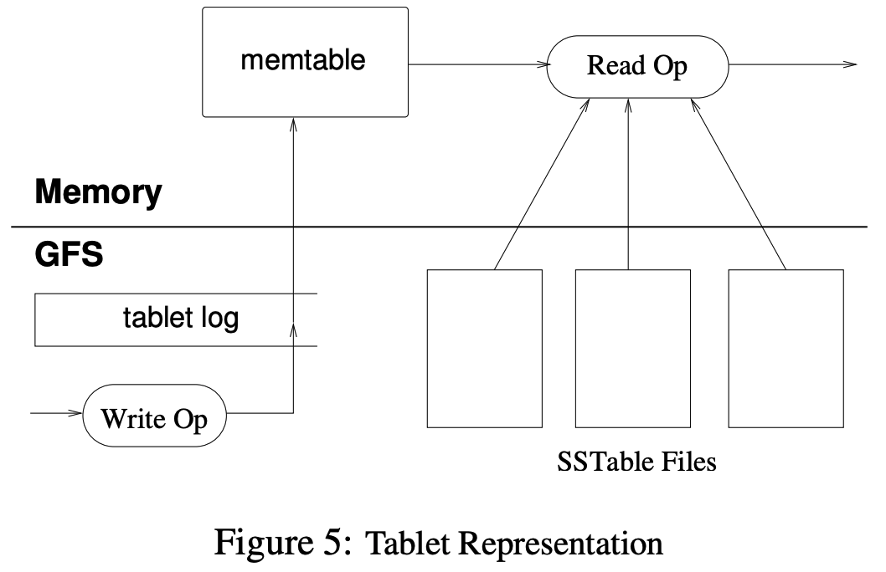
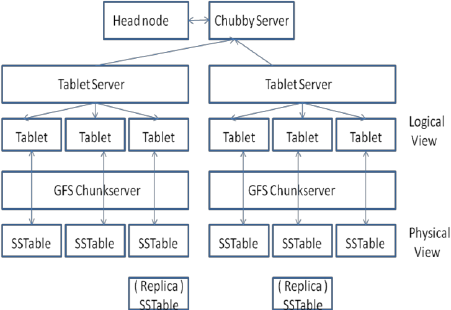

A short version of notes:
<object data="../assets/img/bigtable/bigtable.pdf" type="application/pdf" width="700px" height="1000px">
    <embed src="../assets/img/bigtable/bigtable.pdf">
        <p>This browser does not support PDFs. Please download the PDF to view it: <a href="../assets/img/bigtable/bigtable.pdf">Download PDF</a>.</p>
    </embed>
</object>

# Supplements 

A Bigtable is a *sparse*, *distributed*, *persistent multi-dimensional sorted* map.

key-value: 
`(row: string, column: string, time: int64) --> string`

## Data Model
A BigTable is a table of data with `rows` and `columns`.

**Rows** are uniquely identified by a key
**Columns** are organized column families
**Values** in each cell are versioned based on timestamp.



### Row
- The row keys are arbitrary strings
- Access to data under a single row key is atomic
- Data are in lexicographic order by row key
- *Tablet*: Row range for a table is **dynamically** partitioned and each row range is called a *tablet*; A unit of distribution and load balancing

Clients can exploit this property by selecting their row keys so that they get good locality for their data accesses.

### Column
- Column keys are grouped into sets called *column families*, which form the basic unit of access control
  - All data stored in a column family is usually of the same type. They are compressed in the same column family together
  - Access control and both disk and memory accounting are performed at the column-family level
- Column key: *family:qualifier*
  - family: printable
  - qualifier: arbitrary strings
  
### Timestamp
- Versioning
  - 64-bit integers timestamp
  - default to current time or expilicily set by clients
  - different versions of a cell are stored in decreasing timestamp order
- Lookup
  - return most recent k values
  - return all values within a timestamp range
- Garbage collection
  - only the last k versions of a cell be kept
  - only new-enough versions be kept

## API
- Create/delete/mange tables
  - new column families
- CRUD
  - Create a row via `PUT`
  - Read a row via `GET`
  - Write/Update a row **atomically** via `PUT`
  - Updates: can be conditional
  - Delete a row via `DELETE`
  - Transaction: single row read-modify-write
- Scan: Iterator
  - Sequential read over ranges of rows

### Other features
- Bigtable supports single-row transactions
- Bigtable allows cells to be used as integer counters
- Bigtable supports the execution of client-suppiled scripts in the address space of the servers

## Building Blocks
Bigtable is built on several other Google infrastructure:
1. GFS: to store log and data files of Bigtable
   - SSTable: to store Bigtable data
     - contains a sequence of blocks
     - A block index to locate block
2. Chubby: A highly-available and persistent distributed lock service
   - to ensure that there is at most one active master at any time
   - to store the bootstrap location of Bigtable data
   - to discovery tablet services and finalize tablet service deaths
   - to store Bigtable schema information
   - to store access control lists

## Implmentation
Bigtable has **three** major components: `A library that is linked to every client`, `one master server`, and `many tablet servers`

**Master server** is responsible for 
- assigning tablets to table servers
- detecting the addition and expiration of tablet servers
  - Tablet servers can be dynamically added or removed from a cluster to accomodate changes in workloads
- balancing tablet-server load
- garbage collecting of files in GFS
- handling schema changes: table and column family creations

**Tablet server** manages a set of tablets
- read and write request that it has loaded
- split tablet that has grown too large

**Clients** communicate directly with tablet servers for reads and writes. Clients do not rely on the master for the tablet location information. So, **most clients never communicate with the master**.

**A Bigtable cluster** stores a number of **tables**. Initially, each table consists of just one tablet. As a table grows, it is automatically split into multiple tablets, each approximately `100-200` MB in size by default.

### Tablet Location


1. **Chubby file**: stores the location of the *root **tablet***

2. **Root tablet**: contains the **location** of all **tablets** in a special *METADATA* table. 

3. ***METADATA* tablet**: contains the **location** of a set of **user tablets**

The **root tablet** is just the **first tablet** in the **METADATA table** and it is never split to ensure that the tablet location hierarchy has no more than three levels.

The ***METADATA* table** stores the location of a tablet under a row key that is an encoding of the tablet’s table identifier and its end row. It also stores secondary information including a log for all events pertaining to each tablet.

**The client library caches tablet locations.**  It recursively moves up the tablet location hierarchy on cache miss (not found or wrong). The client library does also prefetching.

### Tablet Assignment
- Each tablet is assigned to one tablet server at a time.
- Bigtable uses Chubby to keep track of tablet servers. 
  - When a tablet server starts, it creates, and acquires an exclusive lock on, a uniquely-named **file** in a specific **Chubby directory**
  - The master monitors this **directory** to discover tablet servers
  - A tablet server stops serving its tablets if it loses its exclusive **lock**
  - A tablet server will attempt to reacquire an exclusive **lock** on its file as long as the **file** still exists
  - If the file no longer exists, the tablet server will never be able to serve again, so it kills itself
  - Whenever a tablet server terminates, it attempts to release its **lock** so that the master will reassign its tablets more quickly
- Master is responsible for detecting when a tablet server is no longer available
  - Master periodically asks each tablet server for the status of its lock
    - If a tablet server reports that it has lost its lock, or if the master was unable to reach a server during its last several attempts, the master attempts to acquire an exclusive lock on the server's file
    - If the master is able to acquire the lock, then Chubby is live and the tablet server is either dead or having trouble reaching chubby, so the master ensures that the tablet server can never serve again by deleting its server file
    - Once a server's file has been deleted, the master can move all the tablets that were previously assigned to that server into the set of unassigned tablets
- Master at startup
   1. The master grabs a unique *master* lock in Chubby to prevent concurrent master instantiations
   2. The master scans the servers **directory** to find the live servers
   3. The master communicates with every live tablet server to discover what tablets are already assigned to each server
   4. The master scan *METADATA* table to learn the set of tablets and move unassigned tablets to the set of unassigned tablets where they wait to be assigned
       - The scan cannot happen until the *METADATA* tablets have been assigned. The [root tablet](#tablet-location) will added to the set of unassigned tablets before step 3.
- The set of existing tablets only changes when a table is **created** or **deleted**, two existing tablets are **merged** to form one larger tablet, or an existing tablet is **split** into two smaller tablets.

### Tablet Serving


- **Updates** are commited to a commit log that stores *redo* records
- The recently committed updates are stored in memory in a sorted buffer called a ***memtable***
- The older updates are stored in a sequence of ***SSTables***

To recover a tablet:
  1. A tablet server reads its metadata from the *METADATA* table
  2. The metadata has the list of SSTables that comprise a tablet and a set of a [redo points](#compactions)
  3. The server reads the indices of the SSTables into memory and reconstructs the memtable by applying all of the updates that have committed since the redo points

Write operation:
   1. Check the access permissions
   2. A valid mutation is wriiten to the commit log (Group commit)
   3. The contents of write are inserted into the memtable

Read operation:
   1. Check the access permissions
   2. A valid read operation is executed on a merged view of the sequence of SSTable and the memtable

### Compactions
- When memtable reaches a threshold size, a minor compaction happens
  - memtable is frozen and written to GFS as an SSTable
  - new memtable is created, and tablet log **"redo point"** is updated
  - goals: reduce memory footprint, reduce amount of tablet log read during recovery
- Periodically, do a merging compaction
  - read multiple SSTables and memtable, write out a single new SSTable
- Once in a while, do a major compaction
  - merging compaction that produces a single SSTable
  - let you supress deleted data, that previously lived in old SSTables (tombstoens)

### Refinements
- **Locality groups**: Grouping mulitple column families together into a *locality group*. Segregating column families that are not typically accessed together into seperate locality groups. Each *locality group* is stored in a seperate SSTable
- **Compression**: compress the SSTable for a locality group; 10-to-1 reduction in space
- **Caching for read performance**: two levels of caching in tablet servers, 
  - the **Scan Cache**: higher-level cache caching the key-value pairs returned by the SSTable interface to teh tablet server code
  - the **Block Cache**: lower-level cache that caches SSTables blocks that were read from GFS
- **Bloom filters**: A Bloom filter allows us to ask whether an SSTable might contain any data for a specified row/column pair.
- **Commit-log implementation**: append mutations to a single commit log per tablet server, co-mingling mutations for different tablets in the same physical log file
- **Speeding up tablet recovery**: minor compaction on the source tablet server when doing a tablet migration. Another minor compaciont before tablet server goes down
- **Exploiting immutability**: 
  - The only mutable data structure that is accessed by both reads and writes is the memtable and each memtable row can do copy-on-write; 
  - Garbage collecting obsolete SSTable
  - Immutability of SSTable enables quicker tablets split. The child tablets share the SSTables of the parent tablet instead of generating a new set of SSTables for each child tablet

### Architecture Overview


### Questions
#### How are the mapping of tablets to tables stored?
Each tablet in Bigtable is associated with a specific table, and the mapping between tablets and tables is maintained by the metadata layer in the Bigtable system.

To determine which tablets belong to a particular table, you would look at the metadata for each tablet and check the name of the table associated with it.

#### So, memtable, SSTables and commit log store the same kind of data?
No, the commit log contains [redo records](https://docs.oracle.com/cd/E18283_01/server.112/e17120/onlineredo001.htm).
An entry in commit log might be in this format:
```yaml
Timestamp: 2022-01-01 12:00:00
Table: users
Row Key: user123
Column Family: personal_info
Column Qualifier: email
Value: user123@example.com
```

#### What are the indices of the SSTables?
The B-tree index structure used in Bigtable is used to index the blocks that store SSTables.

Each block in Bigtable is associated with a range of keys, and the B-tree structure is used to map keys to the appropriate blocks. This allows for efficient lookups of data, even when the data is stored across many blocks.

#### What is the merged view?
The merged view in Bigtable refers to the combined view of the data that is stored in multiple SSTables, providing a single, unified view of the data and a single, unified interface for performing operations on the data.

The merged view is implemented as a skip list, which is a data structure that allows for efficient traversal of large data sets. The skip list is used to traverse the SSTables on disk and merge their data into a single view, which is then returned to the client.