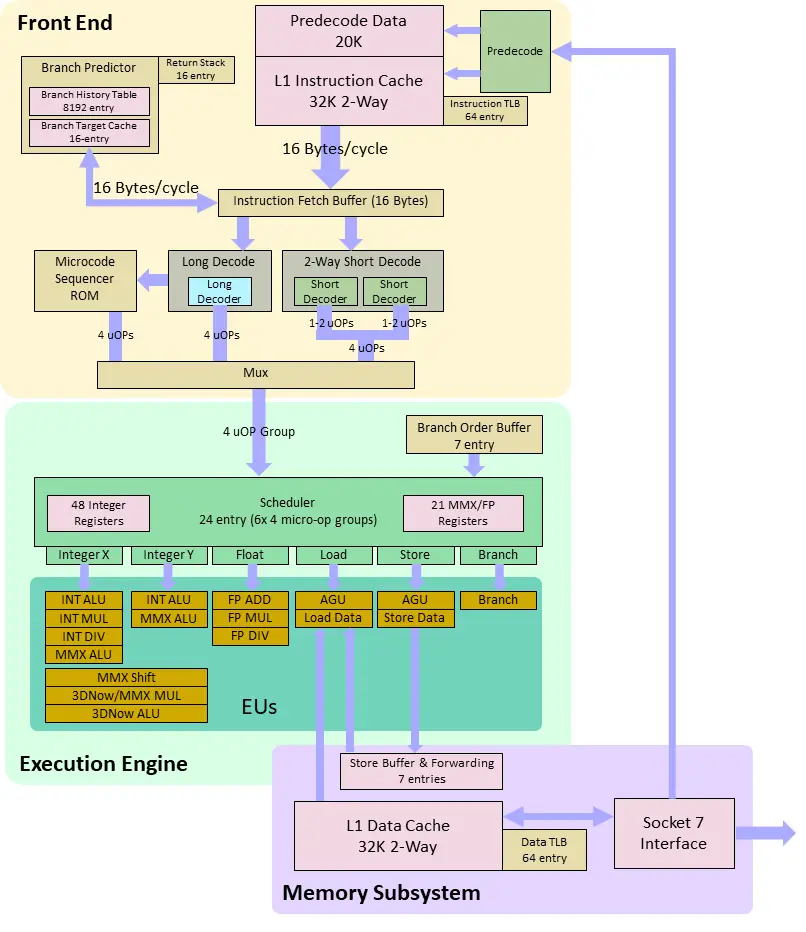
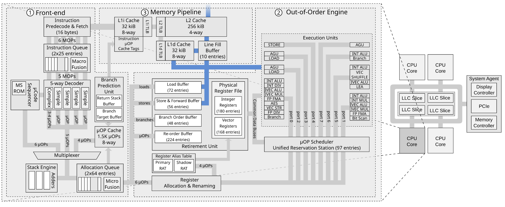

## Introduction
```c
#include <stdio.h>
#include <pthread.h>
#include <immintrin.h>

int value = 0;
int valueIsReady = 0;

void* run1(void *ptr) {
    int tid = 0;
    value = 42;
    _mm_mfence();
    valueIsReady = 1;
    _mm_mfence();
    printf("%d: done\n", tid);
}

void* run2(void *ptr) {
    int tid = 1;
    while (valueIsReady == 0)
        _mm_mfence();
    printf("%d: value is %d\n", tid, value);
}

int main() {
    pthread_t thread1, thread2;
    pthread_create(&thread1, NULL, run1, NULL);
    pthread_create(&thread2, NULL, run2, NULL);
    pthread_join(thread1, NULL);
    pthread_join(thread2, NULL);

    return 0;
}
```
Running results:
```
0: done
1: value is 42
```

The above code is an example where memory fence plays a crucial role to have the program running correctly. 

The memory fence guarantees that the instructions before the fence are all carried out before the instructions after the fence. 

Threads can running on different cores, which means they might not share the same cache but the main memory. My question is that how memory fence is working for threads running on different cores.

## Commit Order != Memory Order

source: https://en.wikichip.org/wiki/amd/microarchitectures/k6

The above figure demonstrates the microarchitecture of AMD K6. It has three parts `Front End, Execution Engine, and Memory Subsystem`. 

The `Execution Engine` guarantees that instructions are committed in program order. However, if we look closer, we can see there is a `store buffer` in `Memory Subsystem`. Although instructions are committed in program order, the instructions may not access the memory bus in the program order because of the existence of store buffer.

So, memory fence acts more to guarantee the order of instructions in store buffer. 

#### How are the memory accessing instrucitons from different threads ordered in the store buffer with memory fence?


We can see from the above figure that each physcial core has its own full components of `front end`, `out-of-order engine`, and `memory pipeline` including all kinds of `buffers`. 

For situation like hyper threading, Intel partitions the store buffer in two; each logical core gets half. Loads from one logical core only snoop its own half of the store buffer [[source]](https://stackoverflow.com/questions/32979067/what-will-be-used-for-data-exchange-between-threads-are-executing-on-one-core-wi).


## How memory fence works?
Memory barriers don't cause the store buffer to be flushed, full barriers make the current core wait until the store buffer drains itself

Load buffer + store buffer entries collectively form the **Memory Order Buffer (MOB)**. This structure is presumably where `mfence` and `lock`ed instructions can put a barrier that blocks StoreLoad reordering without blocking out-of-order execution.

source: https://stackoverflow.com/a/54880249