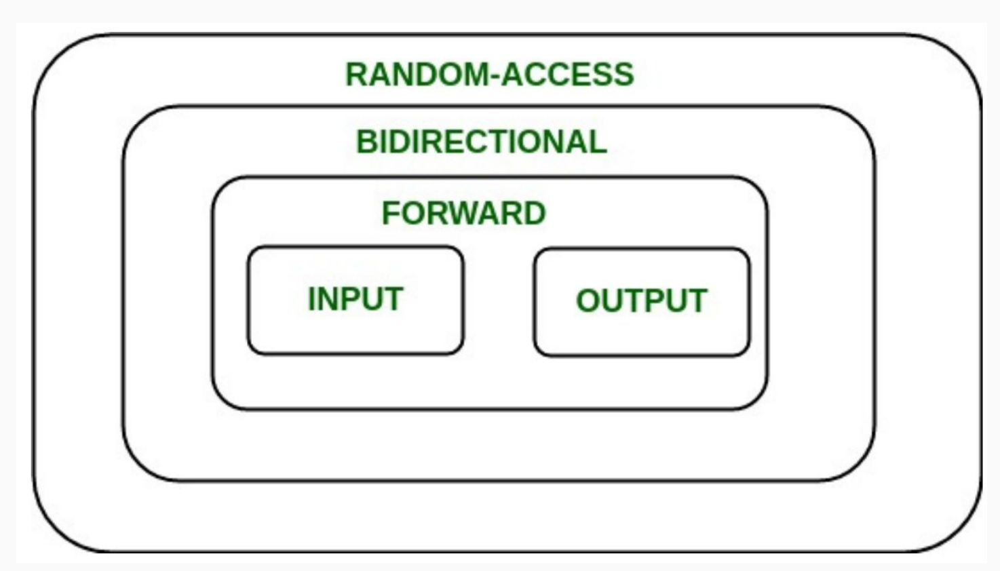

## Initialization & References
#### Initialization
- **Direct initialization**: `int num = 12` or `int num(12.0) (narrowing conversion)`
- **Uniform initialization** (Safe and Ubiquitous): `int num{12}`. Uniform initialization **does** care about types.
- **Structured Binding** (C++ 17): e.g. `return {className, buildingName, language}`
```c++
#include <iostream>
#include <string>

using namespace std;

struct Student
{
    string name;
    string state;
    int age;
};


int main() {
    Student s{"Haven", "AR", 12};
    // Student s{"Haven", "AR", 12.0}; fail compilation 
}
```

#### References
```c++
int num = 5;
int& ref = num;
```
ref is a variable of type `int&`, that is an ***alias*** to `num` (Pointing to the same memory address).

##### Passing by reference
`void squareN(int& N)`: **take in the actual piece of memory, don't make a copy**

##### Passing by value
`void squareN(int N)`: **make a copy, don't take in the actual variable**

##### A classic reference-copy bug
```c++
#include <iostream>
#include <math.h>
#include <vector>

void shift(std::vector<std::pair<int, int>> &nums) {
    for (auto [num1, num2]: nums) { // passing by value here. should be auto& [num1, num2]
        num1++;
        num2++;
    }
}
```

#### l-value and r-value
##### Is `int& num` an l-value?
1. r-values are temporary
2. we cannot pass in an r-value by reference because they're temporary. (No memory address) 

#### const
**A qualifier for objects that declares they cannot be modified.**

**You can't declare a non-const reference to a const variable**

```c++
const std::vector<int> const_vec{1, 2, 3};
const std::vector<int>& const_ref_vec{const_vec};
```

## Streams
**A general input/output(IO) abstraction for C++**, providing interface for reading and writting data.


#### standard iostreams -- basic_ostream and basic_istream


#### std::stringstream -- a way to treat strings as streams

`>>` only reads to the next whitespace. 

`istream& getline(istream& is, string& str, char delim)`: reads up until the `delim` char and stores it in some buffer, `str`. `delim` is by default `\n`. And `getline()` consumes the delim character.


#### Output Streams
`std::cout` stream is **line-buffered**. Contents in buffer not shown on external source until an explicit flush occurs.

`std::endl` tells the stream to end the line and also to **flush**. **Flushing** is an expensive operation.

> In many implementations, **standard output** is line-buffered, and writing '\n' causes a flush anyway, **unless std::ios::sync_with_stdio(false) was executed**. In those situations, unnecessary endl only degrades the performance of file output, not standard output.
>
>   https://en.cppreference.com/w/cpp/io/manip/endl


#### Input/Output File Streams
`std::ifstream` and `std::ofstream`

##### std::cin
- buffered
- buffer stops at a whitespace --> `std::cin` reads only until the next whitespace

## Containers

#### Two types of containers:
- Sequence:
  - Containers that can be accessed sequentially
  - Anything with an inherent order goes here
- Associative:
  - Containers that don't necessarily have a sequential order
  - More easily searched
  - Maps and sets go here

#### Maps
**Maps are implemented with pairs** (std::pair<const key, value>)

- **const key**: Keys are immutable
- Indexing into the map (myMap[key]) searches through the underlying collection of pairs first attribute for the key and will return its second attribute

##### Ordered/Unordered maps and sets
- **Ordered** maps/sets require a **comparison operator** to be defined
- **Unordered** maps/sets require a **hash function** to be defined

Unordered maps/sets are usually faster than ordered ones!

#### Container Adaptors
Container adaptors are "wrappers" to existing containers
- Wrappers **modify the interface** to sequence containers and change what the client is allowed to do/how they can interact with the containers

For example, how to make a wrapper to implement a queue from a deque?

## Iterators and Pointers
#### Iterators
- Iterators let you access **all** data in containers programmatically
- An iterator has a certain **order**; it knows what element will come next
  - Not necessarily the same each time you iterate

In the STL, all containers implement iterators, but they are not all the same.
- Each container has its own iterator, which can have different **behaviour**.
- All iterators implement a few shared operations:
  - Initializing: s.begin()
  - Incrementing: ++iter
  - Dereferencing: *iter
  - Comparing: iter != s.end()
  - Copying: new_iter = iter


- **Input** iterators can appear on the RHS of an = operator (`auto elem = *it;`)
- **Output** iterators can appear on the LHS of an = operator
- **Bidirectional** iterators can go forward as well as backward (`--iter; ++iter;`)
- **Random-access** iterators allow you to direcly access values without visiting all elements sequentially (`iter += 5;`)

**Iteration with iterators is const**: When you iterate over a container using iterators, the elements accessed through the iterators are treated as const. This means you can read the values but cannot modify them through the iterator.

#### Pointers
Iterators are a particular type of pointer
- Iterators "point" at particluar elements in a **container**
- Pointers can "point" at **any objects** in your code


## Class
- Containers are classes defined in the STL

#### Comparing 'stuct' and 'class'
***structures which are classes without access restrictions;***

#### Class design
1. A constructor
2. Private member functions/variables
3. Public member functions (interface for a user)
4. Destructor

### Container adapters
- Container adapters provide the interface for serveral classes and act as a template parameter

### Inheritance
- A virtual function, meaning that it is instantiated in the base class but overwritten in the subclass.

## Template Classes
Template Class: A class that is parametrized over some number of types; it is comprised of memober variables of a general type/types

A {template} container.h
```c++
template <typename T>
// or template <typename T, typename U>, A template declaration list
class Container {
  public:
    Container (T val);
    T getValue();
  
  private:
    T value;
}
```

### Template functions
Spot the difference:
```c++
template <class T>
Container<T>::container(T val) {
  this->value = val;
}

template <typename T>
T container<T>::getValue() {
  return value;
}
```

```c++
template <class T> // class and typename are interchangeable in basic cases
Container::Container(T val) {
  this->value = val;
}

template <typename T>
T Container::getValue() {
  return value;
}
```
In the second code snippet, we don't pass in the template parameter in the class namespace

C++ wants us to specify our template parameters in our namespace because, based on the parameters our class may behave differently. **There is no "one" Container, there is one for an int, char, etc.**

##### Another quirk of templates
When making template classes you need to #include the `.cpp` implementation in the `.h` file. A compiler quirk.
```c++
template <typename T>
class Container {
  public:
    Container (T val);
    T getValue();
  
  private:
    T value;
}

//must include this
#include "Container.cpp"
```

### Const correctness
```c++
std::string stringify(const Student& s) {
  return s.getName() + " is " + std::to_string(s.getAge()) + " years old";
}
```
**Compile error** for the above code.
- By passing in `s` as `const` we made a promise to *not* modify `s`
- The compiler doesn't know wheter or not **getName()** and **getAge()** modify `s`
- Remember, member functions *can* access and modify member variables

Solution:
```c++
...
  private:
    using String = std::string;
    ...
  public:
    ...
    String getName() const;
    int getAge() const;
    ...
...
```

### Const Interface
Definition: Objects that are const can only interact with the const-interface

The const interface is simply the functions taht are const/do not modify the object/instance of the class

```C++
...
int& at(size_t index) {
  return _array[index];
}

int& at(size_t index) const { // a const version of our .at()
  return _array[index];
}
...
```

But this process can be very painful when the size of the function grows.

Solution: **Casting**
```c++
int& findItem(int value) {
  for (auto& elem: arr) {
    if (elem == value) return elem;
  }

  throw std::out_of_range("value not found");
}

const int& findItem(int value) const { 
  return const_case<IntArray&> (*this).findItem(value);
}
```
Breakdown:
- `(*this)`: cast so that it is pointing to a non-const object
- Call the non-const version of the function
- Then cast the non-const return from the function call to a const version

## Template Functions
Functions whose functionality can be adapted to more than one type or class without repeating the entire code for each type.
```c++
template <typename Type>
Type myMin(Type a, Type b) {
  return a < b ? a : b;
}
```
- `template` indicating this function is a template
- `typename` specifies that Type is generic
- `Type` list of our template variables

We can define default parameter types. `template <typename Type=int>`

How to call a template functions: `cout << myMin<int>(3, 4) << endl;`

**template functions are not compiled until used!**
- For each instantiation with different parameters, the compiler generates a new specific version of your template
- After compilation, it will look like you wrote each version yourself

### Template metaprogramming
With template metaprogramming, **code runs once during compile time**!
```c++
template<unsigned n>
struct Factorial {
  enum { value = n * Factorial<n - 1>::value };
}

template <> // template class "speciallization"
struct Factorial<0> {
  enum { value = 1 };
}

std::cout << Factorial<10>::value << endl; // prints 3628800, but run during compile time
```

##### constexpr
The `constexpr` keyword specifies a constant expression.
- Constant expressions must be immediately initialized and will run at compile time
- Passd arguments to constant expressions should be const/constant expressions as well

Variables can also be declared as `constexpr`
```c++
constexpr double fib(int n) {
  if (n == 1) return 1;
  return fib(n-1) * n;
}

int main() {
  const long long bigval = fib(20);
  std::cout << bigval << std::endl;
}
```

##### why do we need template metaprogramming?
- Compiled code ends up being smaller
- Something runs once during compiling and can be used as many times as you like during runtime

Applications of TMP:
- Optimizing matrices/trees/other mathematical structure operations
- Policy-based design
- Game graphics

## Functions and Lambdas
### Function Pointers
A function pointer:
- Function pointers can be treated just like other pointers
- They can be passed around like variables as parameters or in template functions
- They can be called like functions
  
However, we cannot pass more than one parameter to the function the function pointer is pointing to.

### Lambdas
Lambdas are inline, anonymous functions that can know about functions declared in their same scope!
```c++
auto var = [capture-clause] (auto param) -> bool {
  ...
}
```
example:
```c++
int limit=5;
auto isMoreThan = [limit] (int n) { return n > limit; };
isMoreThan(6); //true
```

``` c++
[]                  // captures nothing
[limit]             // captures limit by value
[&limit]            // captures limit by reference
[&limit, uppper]    // captures limit by refernce, upper by value
[&, limit]          // captures everything except limit by reference
[&]                 // captures everything by reference
[=]                 // captures everything by value
```

#### Functor
A `Functor` is any class that provides an implementation of operator().
```c++
class functor {
  public:
    int operator() (int arg) const {
      return num + arg;
    }
  private:
    int num;
};

int num = 0;
auto lambda = [&num] (int arg) { num += arg; };
lambda(5);
```
**Lambdas are just a reskin of functors.**

STL has an overarching, standard function object.
`std::function<return_type(param_types)> func;`
Everything (lambdas, functors, function pointers) can be cast to a standard function

#### Virtual Funcitons
- If you have a function taht can take in a pointer to the supercalss, it won't know to use the subclass's function!
- The same issue happens if we create a superclass pointer to an existing subclass object.
- To fix this, we can mark the overridden function as **virtual** in the header
- Virtual functions are functions in the superclass we expect to be overridden later on

```c++
class Animal {
  virtual void speak() {
    std::cout << "I am a animal" << std::endl;
  }
}

class Dog : Animal {
  void speak() {
    std::cout << "I am a animal" << std::endl;
  }
}

void func(Animal* animal) {
  animal->speak();
}

int main() {
  Animal* myAnimal = new Animal;
  Dog* myDog = new Dog;
  func(myAnimal); // I am an animial
  func(myDog);  // I am a dog
}
```