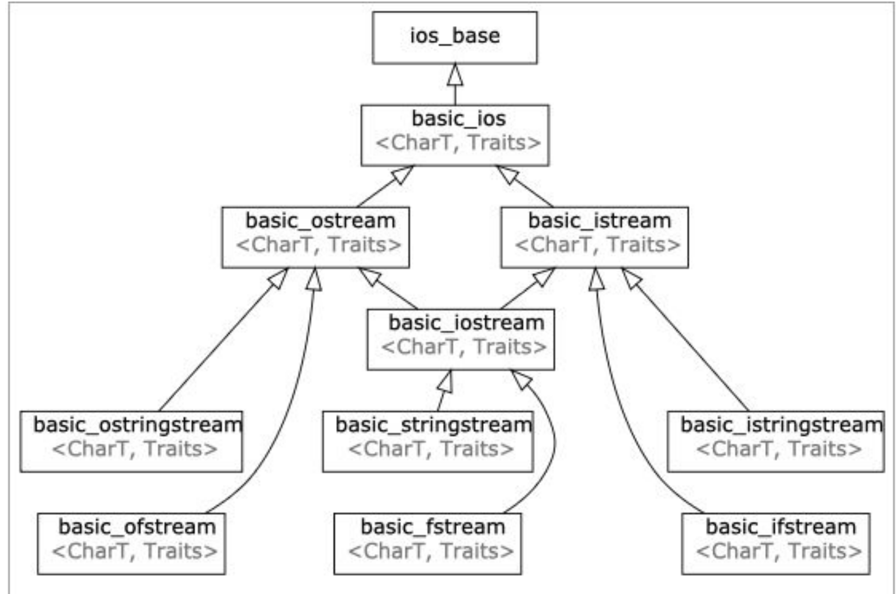

## Initialization & References
#### Initialization
- **Direct initialization**: `int num = 12` or `int num(12.0) (narrowing conversion)`
- **Uniform initialization** (Safe and Ubiquitous): `int num{12}`. Uniform initialization **does** care about types.
- **Structured Binding** (C++ 17): e.g. `return {className, buildingName, language}`
```c++
#include <iostream>
#include <string>

using namespace std;

struct Student
{
    string name;
    string state;
    int age;
};


int main() {
    Student s{"Haven", "AR", 12};
    // Student s{"Haven", "AR", 12.0}; fail compilation 
}
```

#### References
```c++
int num = 5;
int& ref = num;
```
ref is a variable of type `int&`, that is an ***alias*** to `num` (Pointing to the same memory address).

##### Passing by reference
`void squareN(int& N)`: **take in the actual piece of memory, don't make a copy**

##### Passing by value
`void squareN(int N)`: **make a copy, don't take in the actual variable**

##### A classic reference-copy bug
```c++
#include <iostream>
#include <math.h>
#include <vector>

void shift(std::vector<std::pair<int, int>> &nums) {
    for (auto [num1, num2]: nums) { // passing by value here. should be auto& [num1, num2]
        num1++;
        num2++;
    }
}
```

#### l-value and r-value
##### Is `int& num` an l-value?
1. r-values are temporary
2. we cannot pass in an r-value by reference because they're temporary. (No memory address) 

#### const
**A qualifier for objects that declares they cannot be modified.**

**You can't declare a non-const reference to a const variable**

```c++
const std::vector<int> const_vec{1, 2, 3};
const std::vector<int>& const_ref_vec{const_vec};
```

## Streams
**A general input/output(IO) abstraction for C++**, providing interface for reading and writting data.



#### standard iostreams -- basic_ostream and basic_istream


#### std::stringstream -- a way to treat strings as streams

`>>` only reads to the next whitespace. 

`istream& getline(istream& is, string& str, char delim)`: reads up until the `delim` char and stores it in some buffer, `str`. `delim` is by default `\n`. And `getline()` consumes the delim character.


#### Output Streams
`std::cout` stream is **line-buffered**. Contents in buffer not shown on external source until an explicit flush occurs.

`std::endl` tells the stream to end the line and also to **flush**. **Flushing** is an expensive operation.

> In many implementations, **standard output** is line-buffered, and writing '\n' causes a flush anyway, **unless std::ios::sync_with_stdio(false) was executed**. In those situations, unnecessary endl only degrades the performance of file output, not standard output.
>
>   https://en.cppreference.com/w/cpp/io/manip/endl


#### Input/Output File Streams
`std::ifstream` and `std::ofstream`

##### std::cin
- buffered
- buffer stops at a whitespace